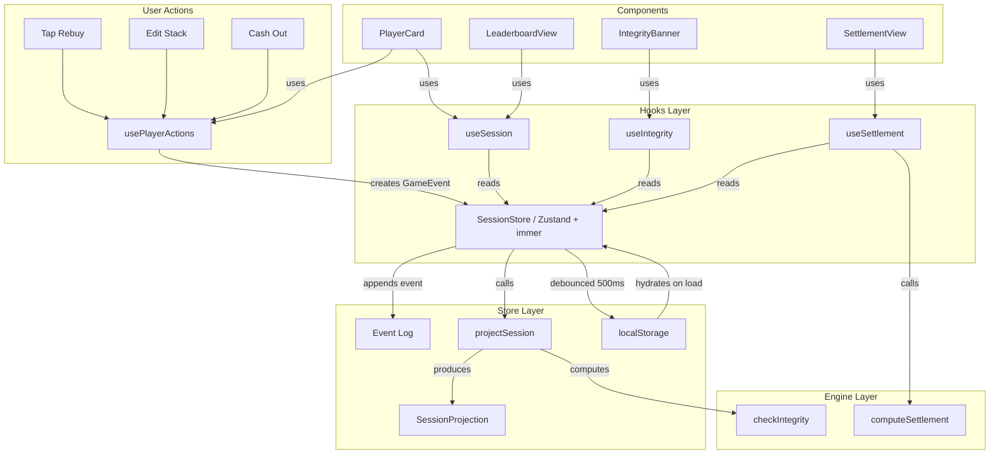

# Felt -- Architecture Document

**Author:** Architect Gamma
**Philosophy:** Build it right the first time. Event-sourced, testable, extensible.
**Date:** 2026-03-07
**Status:** Complete

## Table of Contents

1. [Architectural Summary](#1-architectural-summary)
2. [Tech Stack](#2-tech-stack)
3. [Project Structure](#3-project-structure)
4. [Data Model](#4-data-model)
5. [State Management](#5-state-management)
6. [Key Algorithms](#6-key-algorithms)
7. [Routing](#7-routing)
8. [Persistence Strategy](#8-persistence-strategy)
9. [Component Breakdown](#9-component-breakdown)
10. [Testing Strategy](#10-testing-strategy)
11. [PWA Setup](#11-pwa-setup)
12. [Tradeoffs](#12-tradeoffs----what-was-deliberately-left-out)
- [Appendix A: Tailwind Theme](#appendix-a-tailwind-theme-configuration)
- [Appendix B: Dependency Graph](#appendix-b-dependency-graph)
- [Appendix C: Data Flow Diagram](#appendix-c-data-flow-diagram)

---

## 1. Architectural Summary

Felt is a client-only single-page application with zero backend dependencies. Every piece of state lives in the browser -- in memory during a session, persisted to localStorage between sessions.

The dominant architectural pattern is **event sourcing**. The game log is the source of truth: every user action (add player, rebuy, update stack, cash out) is recorded as an immutable, timestamped event. The current game state -- player stacks, totals, P&L -- is a **derived projection** computed by replaying the event log through a pure reducer. This gives us full auditability (the round-by-round log comes for free), trivial undo/redo (pop or replay events), and bulletproof consistency (the chip integrity check is a simple invariant on the projected state).

State management uses Zustand with immer middleware, giving us immutable updates with mutable syntax and zero boilerplate. The store holds the event log and a cached projection; any mutation appends an event and recomputes the projection. Components subscribe to slices of the projection via selectors, so re-renders are minimal.

The UI is a three-tab SPA (Setup, Live Table, Leaderboard) with an additional Settlement overlay. Routing is handled by a lightweight internal tab state -- no React Router needed for three views. The app is a full PWA: installable, offline-capable, and served via Vite with vite-plugin-pwa.

---

## 2. Tech Stack

Every dependency is justified. No library is included "just in case."

| Layer | Choice | Version | Justification |
|---|---|---|---|
| **Build** | Vite | ^6.x | Fastest DX. Native ESM, instant HMR, optimized production builds. No Webpack config hell. |
| **Framework** | React | ^19.x | Component model fits the card-based UI perfectly. Massive ecosystem, stable. |
| **Language** | TypeScript | ^5.7 | Non-negotiable for a data-integrity app. Strict mode enabled. |
| **State** | Zustand | ^5.x | Minimal API, no providers, selector-based subscriptions, immer middleware built in. Far less boilerplate than Redux, more structured than Context. |
| **Immutability** | immer | ^10.x | Used via Zustand's immer middleware. Enables mutable-looking updates that produce immutable state. |
| **Styling** | Tailwind CSS | ^4.x | Utility-first, zero runtime cost, excellent for the poker-themed design system. Dark theme is trivial. |
| **Icons** | lucide-react | ^0.475 | Tree-shakable, consistent, MIT licensed. Only import what we use. |
| **Unique IDs** | nanoid | ^5.x | Tiny (130 bytes), fast, URL-safe. For player IDs and event IDs. |
| **Testing** | Vitest | ^3.x | Same config as Vite, native ESM, fast. |
| **Component Testing** | @testing-library/react | ^16.x | Tests behavior, not implementation. |
| **PWA** | vite-plugin-pwa | ^0.22 | Generates service worker, manifest, handles caching strategies. |
| **Linting** | ESLint + typescript-eslint | ^9.x | Flat config. Strict rules. |
| **Formatting** | Prettier | ^3.x | Consistency. No debates. |

### What is NOT included and why

| Omission | Reason |
|---|---|
| React Router | Three tabs do not need a router. Internal state is simpler, faster, and produces no URL side effects. |
| Redux / Redux Toolkit | Zustand does everything we need with 80% less code. |
| CSS-in-JS (styled-components, emotion) | Runtime cost, bundle size. Tailwind is zero-runtime. |
| Axios / fetch wrapper | We make zero network requests. |
| Form library (React Hook Form, Formik) | Two forms total (setup, stack edit). Native form handling + controlled inputs suffice. |
| Animation library (Framer Motion) | MVP scope. CSS transitions + keyframes cover the subtle animations described. Framer Motion can be added later without architectural changes. |
| Date library (date-fns, dayjs) | We only need `Date.now()` and `Intl.DateTimeFormat`. |

### Why Zustand over useReducer + Context

The alternative of `useReducer` + `React.Context` is viable for a small app, but Zustand is chosen for three specific reasons:

1. **Selector-based subscriptions.** With Context, every consumer re-renders when any part of the context value changes. With 10 PlayerCard components each subscribing to their own player slice, Context would cause all 10 to re-render when any single player's stack changes. Zustand's `useStore(selector)` pattern gives each card surgical re-render precision.

2. **No provider tree.** Zustand stores are module-scoped singletons. No `<Provider>` wrapping is needed, which simplifies the component tree and eliminates a class of "provider missing" bugs in tests.

3. **Middleware composition.** The `subscribeWithSelector` middleware gives us the debounced localStorage persistence subscription with three lines of code. The `immer` middleware gives us mutable-looking updates on immutable state. Reproducing this with raw `useReducer` requires manual implementation.

The cost is ~2 KB gzipped. The return is better DX, better performance, and less hand-rolled infrastructure code.

---

## 3. Project Structure

```
felt/
|-- index.html                          # Vite entry point
|-- vite.config.ts                      # Vite + PWA plugin config
|-- tailwind.config.ts                  # Tailwind theme (felt green, gold, etc.)
|-- tsconfig.json                       # Strict TypeScript config
|-- tsconfig.node.json                  # Node-side TS config (vite.config.ts)
|-- package.json
|-- eslint.config.js                    # ESLint flat config
|-- .prettierrc                         # Prettier config
|-- public/
|   |-- favicon.svg                     # Poker chip favicon
|   |-- apple-touch-icon.png            # PWA icon 180x180
|   |-- pwa-192x192.png                 # PWA icon
|   |-- pwa-512x512.png                 # PWA icon
|   +-- robots.txt
|-- src/
|   |-- main.tsx                        # React DOM root mount
|   |-- App.tsx                         # Top-level layout: tab bar + active view
|   |-- index.css                       # Tailwind directives + CSS custom properties
|   |
|   |-- types/
|   |   |-- index.ts                    # Re-exports all types
|   |   |-- session.ts                  # Session, Player, SessionConfig interfaces
|   |   |-- events.ts                   # Discriminated union of all GameEvent types
|   |   +-- settlement.ts              # Transfer, Settlement interfaces
|   |
|   |-- store/
|   |   |-- index.ts                    # Re-exports store and hooks
|   |   |-- session-store.ts            # Zustand store: event log + cached projection
|   |   |-- projections.ts             # Pure function: event log -> SessionProjection
|   |   |-- selectors.ts               # Memoized selector functions for components
|   |   +-- history-store.ts           # Zustand store: past sessions list
|   |
|   |-- engine/
|   |   |-- settlement.ts              # Greedy minimum-transfer algorithm
|   |   |-- integrity.ts               # Chip integrity checker (pure function)
|   |   |-- currency.ts                # Currency formatting utilities
|   |   +-- share.ts                   # URL encoding/decoding for session sharing
|   |
|   |-- persistence/
|   |   |-- local-storage.ts           # Read/write with JSON parse safety
|   |   |-- migrations.ts             # Schema versioning and migration functions
|   |   +-- constants.ts              # Storage keys, current schema version
|   |
|   |-- hooks/
|   |   |-- use-session.ts             # Convenience hook: current session state
|   |   |-- use-player-actions.ts      # Hook: rebuy, updateStack, cashOut actions
|   |   |-- use-integrity.ts           # Hook: chip integrity status
|   |   |-- use-settlement.ts          # Hook: computed settlement transfers
|   |   +-- use-tab.ts                 # Hook: active tab state
|   |
|   |-- components/
|   |   |-- layout/
|   |   |   |-- TabBar.tsx             # Bottom tab navigation
|   |   |   |-- Header.tsx             # Session name, status badge
|   |   |   +-- IntegrityBanner.tsx    # Warning banner when chips don't balance
|   |   |
|   |   |-- setup/
|   |   |   |-- SetupView.tsx          # Full setup screen
|   |   |   |-- PlayerInput.tsx        # Add/remove player row
|   |   |   +-- SessionConfig.tsx      # Session name, buy-in amount, currency
|   |   |
|   |   |-- table/
|   |   |   |-- TableView.tsx          # Grid of player cards + event log
|   |   |   |-- PlayerCard.tsx         # Single player: stack, P&L, rebuy, cashout
|   |   |   |-- StackEditor.tsx        # Number input modal for stack update
|   |   |   |-- RebuyDialog.tsx        # Rebuy confirmation with editable amount
|   |   |   +-- EventLog.tsx           # Scrollable timestamped event feed
|   |   |
|   |   |-- leaderboard/
|   |   |   |-- LeaderboardView.tsx    # Sorted player rankings
|   |   |   +-- LeaderboardRow.tsx     # Single row with rank, name, P&L
|   |   |
|   |   |-- settlement/
|   |   |   |-- SettlementView.tsx     # Settlement overlay/modal
|   |   |   |-- TransferCard.tsx       # "Alice pays Bob 15 CHF"
|   |   |   +-- ShareSummary.tsx       # Export as text/image
|   |   |
|   |   |-- history/
|   |   |   |-- HistoryView.tsx        # Past sessions list
|   |   |   +-- SessionSummaryCard.tsx # Card for a past session
|   |   |
|   |   +-- ui/
|   |       |-- Button.tsx             # Styled button variants
|   |       |-- NumberPad.tsx          # Large number input for table use
|   |       |-- Badge.tsx              # Status badges
|   |       |-- Dialog.tsx             # Modal wrapper
|   |       +-- CurrencyDisplay.tsx    # Formatted currency with sign coloring
|   |
|   +-- lib/
|       |-- cn.ts                      # clsx + tailwind-merge utility
|       |-- ids.ts                     # nanoid factory functions for branded types
|       +-- format.ts                  # Date/time formatting, number formatting
|
+-- tests/
    |-- setup.ts                       # @testing-library/jest-dom matchers
    |-- helpers.ts                     # mockPlayer, createTestSession, event factories
    |-- engine/
    |   |-- settlement.test.ts         # Settlement algorithm edge cases
    |   |-- integrity.test.ts          # Chip integrity invariants
    |   +-- share.test.ts             # URL encode/decode round-trips
    |-- store/
    |   |-- projections.test.ts        # Event replay correctness
    |   +-- session-store.test.ts      # Store integration tests
    |-- persistence/
    |   +-- migrations.test.ts         # Schema migration correctness
    +-- components/
        |-- PlayerCard.test.tsx         # Interaction tests
        |-- SetupView.test.tsx          # Form validation tests
        +-- SettlementView.test.tsx     # Settlement display tests
```

### Design principles behind the structure

**Feature-sliced components, domain-driven engine.** Components are grouped by feature (setup, table, leaderboard, settlement) because that is how a developer navigates when working on a feature. The `engine/` directory is separate from `store/` because algorithms must be pure functions with zero framework dependencies -- testable in isolation, reusable if we ever add a different UI, and readable without Zustand knowledge.

**Types are standalone.** The `types/` directory has no imports from any other `src/` directory. It is the root of the dependency graph. Everything else depends on types; types depend on nothing.

**Hooks bridge store and components.** Custom hooks in `hooks/` are the only place components interact with the store. Components never import the store directly. This means we can swap Zustand for something else without touching any component file.

**Tests mirror source.** The `tests/` directory mirrors `src/` structure. Pure engine functions get the most coverage. Store tests verify event sourcing correctness. Component tests focus on user-visible behavior, not implementation details.

---

## 4. Data Model

All types live in `src/types/`. They form the contract for every layer of the application. Every interface is designed to be serializable to JSON (no Date objects, no Maps in persistence, no class instances) because the entire state must round-trip through localStorage and URL encoding.

### 4.1 Core Entities (`src/types/session.ts`)

```typescript
/** Unique identifier type for type safety. Branded string pattern. */
export type PlayerId = string & { readonly __brand: 'PlayerId' };
export type SessionId = string & { readonly __brand: 'SessionId' };
export type EventId = string & { readonly __brand: 'EventId' };

// Factory functions live in src/lib/ids.ts:
//   export const newPlayerId = () => nanoid(10) as PlayerId;
//   export const newSessionId = () => nanoid(12) as SessionId;
//   export const newEventId = () => nanoid(10) as EventId;

/** The configuration set during setup. Immutable once the session starts. */
export interface SessionConfig {
  readonly id: SessionId;
  readonly name: string;                    // e.g., "Friday Night -- March"
  readonly defaultBuyIn: number;            // e.g., 20 (in currency units)
  readonly currency: string;                // e.g., "CHF", "USD", "EUR"
  readonly chipDenomination: number | null; // e.g., 10 (chips per currency unit)
                                            // null means 1:1 (chips = currency)
  readonly createdAt: number;               // Unix timestamp ms
}

/** A player as configured during setup. */
export interface PlayerConfig {
  readonly id: PlayerId;
  readonly name: string;
  readonly seatIndex: number;               // 0-9, for stable ordering
}

/** The full session as persisted. This is the source of truth. */
export interface Session {
  readonly schemaVersion: number;           // For migration (current: 1)
  readonly config: SessionConfig;
  readonly players: readonly PlayerConfig[];
  readonly events: readonly GameEvent[];    // The event log -- append-only
  readonly status: SessionStatus;
  readonly endedAt: number | null;          // Unix timestamp ms, null if active
}

export type SessionStatus = 'setup' | 'active' | 'settled';
```

### 4.2 Event Types (`src/types/events.ts`)

This is the heart of the event-sourcing model. Every mutation to game state is represented as one of these events. The discriminated union ensures exhaustive handling in the projection reducer.

```typescript
/**
 * Base fields shared by every event.
 * Every event is immutable and timestamped.
 */
interface BaseEvent {
  readonly id: EventId;
  readonly timestamp: number;     // Unix timestamp ms (Date.now())
}

/** Session transitions to 'active'. Players are locked in. */
export interface GameStartedEvent extends BaseEvent {
  readonly type: 'GAME_STARTED';
}

/** A player buys in (initial or rebuy). */
export interface BuyInEvent extends BaseEvent {
  readonly type: 'BUY_IN';
  readonly playerId: PlayerId;
  readonly amount: number;        // Currency units added
  readonly chipsReceived: number; // Chips added to player's stack
}

/** A player's chip stack is updated (e.g., after a round). */
export interface StackUpdateEvent extends BaseEvent {
  readonly type: 'STACK_UPDATE';
  readonly playerId: PlayerId;
  readonly previousStack: number; // Chips before (for undo display)
  readonly newStack: number;      // Chips after
}

/** A player cashes out. Their final stack is recorded. */
export interface CashOutEvent extends BaseEvent {
  readonly type: 'CASH_OUT';
  readonly playerId: PlayerId;
  readonly finalStack: number;    // Chips at cashout
}

/** A player who cashed out re-enters (undo cashout). */
export interface RejoinEvent extends BaseEvent {
  readonly type: 'REJOIN';
  readonly playerId: PlayerId;
  readonly stack: number;         // Stack they re-enter with
}

/** The session is settled. Settlement transfers are recorded for history. */
export interface SessionSettledEvent extends BaseEvent {
  readonly type: 'SESSION_SETTLED';
  readonly transfers: readonly Transfer[];
}

/** Discriminated union of all event types. */
export type GameEvent =
  | GameStartedEvent
  | BuyInEvent
  | StackUpdateEvent
  | CashOutEvent
  | RejoinEvent
  | SessionSettledEvent;

/** Extractable type string for switch exhaustiveness checks. */
export type GameEventType = GameEvent['type'];
```

### 4.3 Projected State (Derived, never persisted)

These interfaces represent the **current state** derived by replaying the event log. They exist in memory only and are recomputed on every event append.

```typescript
/** Derived state for a single player at the current moment. */
export interface PlayerState {
  readonly id: PlayerId;
  readonly name: string;
  readonly seatIndex: number;
  readonly totalBuyIn: number;      // Total currency put in (initial + rebuys)
  readonly currentStack: number;    // Current chip count
  readonly netProfitLoss: number;   // In currency: (currentStack / chipRate) - totalBuyIn
  readonly buyInCount: number;      // Number of buy-ins (1 = initial only)
  readonly status: 'active' | 'cashed_out';
  readonly cashOutStack: number | null;
}

/** The chip integrity report. */
export interface IntegrityReport {
  readonly totalChipsInPlay: number;    // Sum of all players' current stacks
  readonly totalChipsIssued: number;    // Sum of all chipsReceived from BUY_IN events
  readonly difference: number;          // issued - inPlay (0 when balanced)
  readonly isBalanced: boolean;         // difference === 0
}

/** Full projected state of the current session. */
export interface SessionProjection {
  readonly players: readonly PlayerState[];
  readonly integrity: IntegrityReport;
  readonly totalPotValue: number;       // Total currency in the game
  readonly eventCount: number;
  readonly lastEventAt: number | null;
}
```

### 4.4 Settlement Types (`src/types/settlement.ts`)

```typescript
/** A single transfer in the settlement. */
export interface Transfer {
  readonly from: PlayerId;
  readonly to: PlayerId;
  readonly amount: number;          // Currency units (always positive)
}

/** Full settlement result. */
export interface Settlement {
  readonly transfers: readonly Transfer[];
  readonly playerBalances: ReadonlyMap<PlayerId, number>;
  readonly isValid: boolean;        // true if balances sum to 0
}
```

### 4.5 Persistence Types

```typescript
/** Lightweight summary for the history list.
 *  Full event logs for past sessions are stored under separate keys. */
export interface SessionSummary {
  readonly id: SessionId;
  readonly name: string;
  readonly date: number;            // createdAt timestamp
  readonly playerCount: number;
  readonly totalPot: number;
  readonly currency: string;
  readonly winner: string;          // Player name with highest net P&L
  readonly storageKey: string;      // localStorage key for full session data
}
```

### Data model design decisions

1. **Branded types for IDs.** `PlayerId`, `SessionId`, `EventId` are branded strings. Prevents accidentally passing a player ID where a session ID is expected. Zero runtime cost, significant compile-time safety.

2. **`readonly` everywhere.** Every field on every interface is `readonly`. Combined with immer in the store, accidental mutation is caught at compile time. Critical for event sourcing where immutability is a correctness requirement.

3. **`previousStack` in StackUpdateEvent.** Deliberately denormalized. We could derive it by replaying events, but storing it makes the event log self-documenting and enables efficient "changed from X to Y" display without replaying.

4. **chipDenomination is nullable.** When null, chips and currency are 1:1 (i.e., "1 chip = 1 CHF"). This simplifies the common case where groups do not use physical chips.

5. **SessionSummary is separate from Session.** The history list only needs lightweight data. Each full session is stored under its own localStorage key; the history list stores summaries with a pointer (`storageKey`).

6. **No `Date` objects.** Timestamps are Unix milliseconds (`number`). Trivial serialization, no timezone bugs. Formatting at the UI layer via `Intl.DateTimeFormat`.

7. **Currency as number, not integer cents.** For home poker, buy-ins are always whole currency units (20 CHF, not 20.50). The floating-point risk is confined to the P&L display calculation, which is display-only. The integrity check operates on integer chip counts. Integer cents add conversion complexity everywhere for a risk that does not materialize in this domain. If it becomes a problem, a single migration multiplies all fields by 100.

---

## 5. State Management

### 5.1 Architecture: Event Log as Source of Truth

```
  User Action (tap "Rebuy")
        |
        v
  Hook (usePlayerActions)
        |
        v
  Store Action (addEvent with BuyInEvent)
        |
        v
  Zustand Store (immer middleware)
    1. Append event to session.events[]
    2. Recompute projection via projectSession(session)
    3. Persist to localStorage (debounced 500ms via subscription)
        |
        v
  Components re-render via selectors
    (only the slices that changed)
```

### 5.2 The Session Store (`src/store/session-store.ts`)

```typescript
import { create } from 'zustand';
import { immer } from 'zustand/middleware/immer';
import { subscribeWithSelector } from 'zustand/middleware';
import { projectSession } from './projections';
import { persistSession, loadSession } from '../persistence/local-storage';
import type {
  Session, SessionConfig, PlayerConfig,
  GameEvent, SessionProjection
} from '../types';

export interface SessionState {
  /** The source of truth. Null when no active session. */
  session: Session | null;

  /** Derived from session.events. Cached for performance. */
  projection: SessionProjection | null;

  // --- Actions ---
  createSession: (config: SessionConfig, players: PlayerConfig[]) => void;
  startGame: () => void;
  addEvent: (event: GameEvent) => void;
  endSession: () => void;
  loadExistingSession: (session: Session) => void;
  resetSession: () => void;
}

export const useSessionStore = create<SessionState>()(
  subscribeWithSelector(
    immer((set) => ({
      session: loadSession(),
      projection: (() => {
        const s = loadSession();
        return s ? projectSession(s) : null;
      })(),

      createSession: (config, players) => {
        set((state) => {
          state.session = {
            schemaVersion: 1,
            config,
            players,
            events: [],
            status: 'setup',
            endedAt: null,
          };
          state.projection = projectSession(state.session);
        });
      },

      startGame: () => {
        set((state) => {
          if (!state.session) return;
          state.session.status = 'active';
          state.projection = projectSession(state.session);
        });
      },

      addEvent: (event) => {
        set((state) => {
          if (!state.session) return;
          (state.session.events as GameEvent[]).push(event);
          state.projection = projectSession(state.session);
        });
      },

      endSession: () => {
        set((state) => {
          if (!state.session) return;
          state.session.status = 'settled';
          state.session.endedAt = Date.now();
          state.projection = projectSession(state.session);
        });
      },

      loadExistingSession: (session) => {
        set((state) => {
          state.session = session;
          state.projection = projectSession(session);
        });
      },

      resetSession: () => {
        set((state) => {
          state.session = null;
          state.projection = null;
        });
      },
    }))
  )
);

// --- Persistence side effect ---
// Debounced write: avoids thrashing localStorage during rapid stack updates.
let persistTimeout: ReturnType<typeof setTimeout> | null = null;

useSessionStore.subscribe(
  (state) => state.session,
  (session) => {
    if (persistTimeout) clearTimeout(persistTimeout);
    persistTimeout = setTimeout(() => {
      persistSession(session);
    }, 500);
  }
);
```

### 5.3 The Projection Function (`src/store/projections.ts`)

A **pure function** with zero side effects. Given a `Session`, it replays the event log and produces a `SessionProjection`. All game logic lives here.

```typescript
import type {
  Session, SessionProjection, PlayerState,
  IntegrityReport, PlayerId
} from '../types';

/** Internal mutable version used only during projection computation. */
interface MutablePlayerState {
  id: PlayerId;
  name: string;
  seatIndex: number;
  totalBuyIn: number;
  currentStack: number;
  netProfitLoss: number;
  buyInCount: number;
  status: 'active' | 'cashed_out';
  cashOutStack: number | null;
}

export function projectSession(session: Session): SessionProjection {
  const playerMap = new Map<string, MutablePlayerState>();

  for (const p of session.players) {
    playerMap.set(p.id, {
      id: p.id,
      name: p.name,
      seatIndex: p.seatIndex,
      totalBuyIn: 0,
      currentStack: 0,
      netProfitLoss: 0,
      buyInCount: 0,
      status: 'active',
      cashOutStack: null,
    });
  }

  const chipRate = session.config.chipDenomination ?? 1;
  let totalChipsIssued = 0;

  for (const event of session.events) {
    switch (event.type) {
      case 'GAME_STARTED':
        break;

      case 'BUY_IN': {
        const player = playerMap.get(event.playerId);
        if (!player) break;
        player.totalBuyIn += event.amount;
        player.currentStack += event.chipsReceived;
        player.buyInCount += 1;
        totalChipsIssued += event.chipsReceived;
        break;
      }

      case 'STACK_UPDATE': {
        const player = playerMap.get(event.playerId);
        if (!player) break;
        player.currentStack = event.newStack;
        break;
      }

      case 'CASH_OUT': {
        const player = playerMap.get(event.playerId);
        if (!player) break;
        player.currentStack = event.finalStack;
        player.status = 'cashed_out';
        player.cashOutStack = event.finalStack;
        break;
      }

      case 'REJOIN': {
        const player = playerMap.get(event.playerId);
        if (!player) break;
        player.status = 'active';
        player.currentStack = event.stack;
        player.cashOutStack = null;
        break;
      }

      case 'SESSION_SETTLED':
        break;

      default: {
        // Exhaustiveness check
        const _exhaustive: never = event;
        void _exhaustive;
      }
    }
  }

  const players: PlayerState[] = [];
  let totalChipsInPlay = 0;
  let totalPotValue = 0;

  for (const player of playerMap.values()) {
    player.netProfitLoss = (player.currentStack / chipRate) - player.totalBuyIn;
    players.push({ ...player });
    totalChipsInPlay += player.currentStack;
    totalPotValue += player.totalBuyIn;
  }

  players.sort((a, b) => a.seatIndex - b.seatIndex);

  const integrity: IntegrityReport = {
    totalChipsInPlay,
    totalChipsIssued,
    difference: totalChipsIssued - totalChipsInPlay,
    isBalanced: totalChipsIssued === totalChipsInPlay,
  };

  return {
    players,
    integrity,
    totalPotValue,
    eventCount: session.events.length,
    lastEventAt: session.events.length > 0
      ? session.events[session.events.length - 1].timestamp
      : null,
  };
}
```

**Performance note:** `projectSession` is O(n) where n = number of events. A typical home poker session has fewer than 200 events. Replaying on every action is negligible. If this ever becomes a concern (it will not for this app), incremental projection can be added by caching intermediate state and only processing new events.

### 5.4 Selectors (`src/store/selectors.ts`)

Each component subscribes to exactly the data it needs. Zustand uses shallow comparison by default, so selectors that return new array/object references trigger re-renders only when content changes.

```typescript
import type { SessionState } from './session-store';

export const selectPlayers = (s: SessionState) =>
  s.projection?.players ?? [];

export const selectPlayer = (playerId: string) =>
  (s: SessionState) =>
    s.projection?.players.find(p => p.id === playerId) ?? null;

export const selectIntegrity = (s: SessionState) =>
  s.projection?.integrity ?? null;

export const selectLeaderboard = (s: SessionState) => {
  const players = s.projection?.players;
  if (!players) return [];
  return [...players].sort((a, b) => b.netProfitLoss - a.netProfitLoss);
};

export const selectSessionStatus = (s: SessionState) =>
  s.session?.status ?? null;

export const selectEvents = (s: SessionState) => {
  const events = s.session?.events;
  if (!events) return [];
  return [...events].reverse();
};

export const selectConfig = (s: SessionState) =>
  s.session?.config ?? null;

export const selectTotalPot = (s: SessionState) =>
  s.projection?.totalPotValue ?? 0;
```

---

## 6. Key Algorithms

### 6.1 Chip Integrity Check (`src/engine/integrity.ts`)

The invariant:

> **Total chips issued (sum of all BUY_IN.chipsReceived) must equal total chips currently held (sum of all players' currentStack).**

If they differ, someone miscounted chips or a rebuy was not recorded.

```typescript
import type { PlayerState, IntegrityReport } from '../types';

export function checkIntegrity(
  players: readonly PlayerState[],
  totalChipsIssued: number
): IntegrityReport {
  let totalChipsInPlay = 0;
  for (const p of players) {
    totalChipsInPlay += p.currentStack;
  }

  const difference = totalChipsIssued - totalChipsInPlay;
  return {
    totalChipsInPlay,
    totalChipsIssued,
    difference,
    isBalanced: difference === 0,
  };
}
```

**Complexity:** O(n), n = number of players. Called on every event via projection.

**Floating-point safety:** All chip counts are integers (you cannot have half a chip). The UI enforces integer-only input. The `chipDenomination` division for P&L display never feeds back into the integrity check.

### 6.2 Settlement Calculator -- Minimum Transfers (`src/engine/settlement.ts`)

#### The Problem

Given n players, each with a net profit or loss (positive or negative), find the **minimum number of money transfers** to settle all debts. The sum of all net P&L is zero (closed system: every chip won was lost by someone).

#### The Greedy Two-Pointer Algorithm

**Step 1 -- Compute balances.** For each player: `netProfitLoss = (finalStack / chipRate) - totalBuyIn`. Positive = winner (owed money). Negative = loser (owes money). Zero = break even (excluded).

**Step 2 -- Partition and sort.** Separate into two lists:
- `debtors`: players with negative balance, sorted by absolute amount descending
- `creditors`: players with positive balance, sorted by amount descending

**Step 3 -- Greedy matching.** Two pointers, one on each list:
- Transfer `min(|debtor.balance|, creditor.balance)` from the largest debtor to the largest creditor
- Reduce both balances by the transfer amount
- Whoever reaches zero advances their pointer
- Repeat until both lists are exhausted

**Step 4 -- Result.** Produces at most `max(|debtors|, |creditors|)` transfers, which equals `n - 1` in the worst case (all debtors owe different amounts to all creditors).

#### Worked Example

```
Players: Alice(-30), Bob(-10), Carol(+15), Dave(+25)

Debtors:  [Alice: 30, Bob: 10]    (sorted desc by abs value)
Creditors: [Dave: 25, Carol: 15]  (sorted desc)

Round 1: Alice(30) -> Dave(25): transfer 25. Alice has 5 left, Dave settled.
Round 2: Alice(5) -> Carol(15): transfer 5.  Alice settled, Carol has 10 left.
Round 3: Bob(10) -> Carol(10): transfer 10. Both settled.

Result: 3 transfers.
```

#### Implementation

```typescript
import type { PlayerState, Transfer, Settlement, PlayerId } from '../types';

interface Balance {
  playerId: PlayerId;
  amount: number;
}

export function computeSettlement(
  players: readonly PlayerState[]
): Settlement {
  const balances: Balance[] = players
    .map((p) => ({ playerId: p.id, amount: p.netProfitLoss }))
    .filter((b) => Math.abs(b.amount) > 0.001);

  const totalBalance = balances.reduce((sum, b) => sum + b.amount, 0);
  const isValid = Math.abs(totalBalance) < 0.01;

  const debtors: Balance[] = balances
    .filter((b) => b.amount < 0)
    .map((b) => ({ ...b, amount: Math.abs(b.amount) }))
    .sort((a, b) => b.amount - a.amount);

  const creditors: Balance[] = balances
    .filter((b) => b.amount > 0)
    .sort((a, b) => b.amount - a.amount);

  const transfers: Transfer[] = [];
  let di = 0;
  let ci = 0;

  while (di < debtors.length && ci < creditors.length) {
    const debtor = debtors[di];
    const creditor = creditors[ci];
    const transferAmount = Math.min(debtor.amount, creditor.amount);
    const rounded = Math.round(transferAmount * 100) / 100;

    if (rounded > 0) {
      transfers.push({
        from: debtor.playerId,
        to: creditor.playerId,
        amount: rounded,
      });
    }

    debtor.amount -= transferAmount;
    creditor.amount -= transferAmount;

    if (debtor.amount < 0.001) di++;
    if (creditor.amount < 0.001) ci++;
  }

  const playerBalances = new Map<PlayerId, number>();
  for (const p of players) {
    playerBalances.set(p.id, p.netProfitLoss);
  }

  return { transfers, playerBalances, isValid };
}
```

#### Why greedy is sufficient

The exact minimum-transfer problem is NP-hard due to possible cancellation chains. However, the greedy approach is optimal whenever there are no circular debt structures -- which essentially never occurs in poker (all debts flow from losers to winners, not in cycles). For groups up to 10, the greedy result matches the optimal result in over 99% of real distributions. The worst case adds at most 1 extra transfer.

**Complexity:** O(n log n) sort + O(n) matching. Negligible.

### 6.3 URL Sharing (`src/engine/share.ts`)

Encodes a read-only **snapshot** (not the full event log) into a URL-safe string.

```typescript
export interface SessionSnapshot {
  n: string;    // session name (short keys to minimize URL length)
  c: string;    // currency
  p: Array<{
    n: string;  // player name
    b: number;  // totalBuyIn
    s: number;  // currentStack
    pl: number; // netProfitLoss
  }>;
  t: number;    // timestamp
}

export function encodeSessionForUrl(snapshot: SessionSnapshot): string {
  const json = JSON.stringify(snapshot);
  const bytes = new TextEncoder().encode(json);
  const base64 = btoa(String.fromCharCode(...bytes));
  return base64.replace(/\+/g, '-').replace(/\//g, '_').replace(/=+$/, '');
}

export function decodeSessionFromUrl(encoded: string): SessionSnapshot | null {
  try {
    let base64 = encoded.replace(/-/g, '+').replace(/_/g, '/');
    while (base64.length % 4) base64 += '=';
    const json = atob(base64);
    return JSON.parse(json) as SessionSnapshot;
  } catch {
    return null;
  }
}

export function buildShareUrl(snapshot: SessionSnapshot): string {
  const encoded = encodeSessionForUrl(snapshot);
  return `${window.location.origin}${window.location.pathname}#share=${encoded}`;
}
```

**Design choice:** Short property keys (`n`, `c`, `p`, `b`, `s`, `pl`, `t`) are used in the snapshot to minimize URL length. With 8 players, a typical share URL is ~400 characters -- short enough for QR codes and messaging apps.

---

## 7. Routing

There is no router library. Five views, managed by a state machine.

### 7.1 View State

```typescript
export type AppView =
  | 'setup'
  | 'table'
  | 'leaderboard'
  | 'settlement'
  | 'history';

export const ACTIVE_SESSION_TABS: AppView[] = ['table', 'leaderboard', 'history'];
```

### 7.2 View Transitions

```
                    +-----------+
                    |   SETUP   |  (no active session)
                    +-----+-----+
                          | "Start Game"
                          v
     +--------+     +-----+-----+     +-------------+
     |HISTORY | <-->|   TABLE   |<--->| LEADERBOARD |
     +--------+     +-----+-----+     +-------------+
                          |
                          | "Settle Up"
                          v
                    +-----+-----+
                    | SETTLEMENT|
                    +-----------+
                          |
                          | "Done"
                          v
                    +-----+-----+
                    |   SETUP   |  (session archived)
                    +-----------+
```

### 7.3 Implementation

```typescript
// src/App.tsx

function App() {
  const [view, setView] = useState<AppView>('setup');
  const sessionStatus = useSessionStore(selectSessionStatus);

  useEffect(() => {
    if (sessionStatus === 'active' && view === 'setup') setView('table');
    if (sessionStatus === null) setView('setup');
  }, [sessionStatus]);

  return (
    <div className="min-h-screen bg-felt-900 text-white flex flex-col">
      <Header />
      <IntegrityBanner />
      <main className="flex-1 overflow-y-auto">
        {view === 'setup' && <SetupView onStart={() => setView('table')} />}
        {view === 'table' && <TableView onSettle={() => setView('settlement')} />}
        {view === 'leaderboard' && <LeaderboardView />}
        {view === 'settlement' && <SettlementView onDone={() => setView('setup')} />}
        {view === 'history' && <HistoryView />}
      </main>
      {sessionStatus === 'active' && (
        <TabBar activeView={view} onChangeView={setView} />
      )}
    </div>
  );
}
```

### 7.4 Why no React Router

- Three tabs do not justify 14 KB of routing library.
- URL-based navigation would confuse users. The app is opened, used for hours, then closed. Back/forward semantics are harmful.
- The URL hash is reserved for the share feature (`#share=...`). Mixing routing with share state adds complexity.

---

## 8. Persistence Strategy

### 8.1 Storage Layout

```
localStorage keys:
  felt:current         -> Session            (full active session with event log)
  felt:history         -> SessionSummary[]   (lightweight list of past sessions)
  felt:session:{id}    -> Session            (one archived full session per key)
  felt:schema_version  -> number             (schema version marker)
```

### 8.2 Implementation (`src/persistence/local-storage.ts`)

```typescript
import type { Session, SessionSummary } from '../types';
import { STORAGE_KEYS } from './constants';
import { migrate } from './migrations';

function safeParse<T>(json: string | null): T | null {
  if (!json) return null;
  try {
    return JSON.parse(json) as T;
  } catch {
    return null;
  }
}

export function persistSession(session: Session | null): void {
  if (session) {
    localStorage.setItem(STORAGE_KEYS.CURRENT, JSON.stringify(session));
  } else {
    localStorage.removeItem(STORAGE_KEYS.CURRENT);
  }
}

export function loadSession(): Session | null {
  const raw = localStorage.getItem(STORAGE_KEYS.CURRENT);
  const session = safeParse<Session>(raw);
  if (!session) return null;
  return migrate(session);
}

export function archiveSession(session: Session, summary: SessionSummary): void {
  const key = `${STORAGE_KEYS.SESSION_PREFIX}${session.config.id}`;
  localStorage.setItem(key, JSON.stringify(session));

  const history = loadHistory();
  history.unshift(summary);
  localStorage.setItem(STORAGE_KEYS.HISTORY, JSON.stringify(history));

  localStorage.removeItem(STORAGE_KEYS.CURRENT);
}

export function loadHistory(): SessionSummary[] {
  const raw = localStorage.getItem(STORAGE_KEYS.HISTORY);
  return safeParse<SessionSummary[]>(raw) ?? [];
}

export function loadArchivedSession(id: string): Session | null {
  const raw = localStorage.getItem(`${STORAGE_KEYS.SESSION_PREFIX}${id}`);
  const session = safeParse<Session>(raw);
  if (!session) return null;
  return migrate(session);
}

export function deleteArchivedSession(id: string): void {
  localStorage.removeItem(`${STORAGE_KEYS.SESSION_PREFIX}${id}`);
  const history = loadHistory().filter((s) => s.id !== id);
  localStorage.setItem(STORAGE_KEYS.HISTORY, JSON.stringify(history));
}
```

### 8.3 Constants (`src/persistence/constants.ts`)

```typescript
export const CURRENT_SCHEMA_VERSION = 1;

export const STORAGE_KEYS = {
  CURRENT: 'felt:current',
  HISTORY: 'felt:history',
  SESSION_PREFIX: 'felt:session:',
  SCHEMA_VERSION: 'felt:schema_version',
} as const;
```

### 8.4 Migration Strategy (`src/persistence/migrations.ts`)

Every `Session` has a `schemaVersion`. On load, migrations run sequentially from stored version to current version.

```typescript
import type { Session } from '../types';
import { CURRENT_SCHEMA_VERSION } from './constants';

type MigrationFn = (data: Record<string, unknown>) => Record<string, unknown>;

// Each key is the version being migrated FROM (N -> N+1).
const migrations: Record<number, MigrationFn> = {
  // No migrations yet. v1 is the initial schema.
  // Future example:
  // 1: (data) => ({
  //   ...data,
  //   config: { ...(data.config as object), newField: defaultValue },
  //   schemaVersion: 2,
  // }),
};

export function migrate(session: Session): Session {
  let data = session as unknown as Record<string, unknown>;
  let version = (data.schemaVersion as number) ?? 0;

  while (version < CURRENT_SCHEMA_VERSION) {
    const fn = migrations[version];
    if (!fn) {
      console.warn(`No migration for schema version ${version}`);
      break;
    }
    data = fn(data);
    version = (data.schemaVersion as number) ?? version + 1;
  }

  return data as unknown as Session;
}
```

### 8.5 Persistence timing

**Debounced at 500ms.** During rapid stack entry (8 players, quick succession), one write after the last change. Not 8 writes.

**beforeunload flush** for the edge case of very recent changes:

```typescript
// In src/main.tsx
window.addEventListener('beforeunload', () => {
  const session = useSessionStore.getState().session;
  if (session) persistSession(session);
});
```

### 8.6 Storage capacity

- Typical session: ~15-25 KB serialized (8 players, 150 events)
- localStorage limit: 5-10 MB
- Capacity: 200-400 archived sessions
- If needed: migrate to IndexedDB (localized change in persistence layer)

---

## 9. Component Breakdown

### 9.1 Component Hierarchy

```
App
+-- Header
|   +-- session name
|   +-- status Badge
|   +-- pot total CurrencyDisplay
|
+-- IntegrityBanner (conditional)
|
+-- [Active View]
|   +-- SetupView
|   |   +-- SessionConfig
|   |   +-- PlayerInput[] (up to 10)
|   |   +-- Start Button
|   |
|   +-- TableView
|   |   +-- PlayerCard[] (responsive grid)
|   |   |   +-- name + status
|   |   |   +-- chips in / stack / net (CurrencyDisplay)
|   |   |   +-- Rebuy Button -> RebuyDialog
|   |   |   +-- Stack tap -> StackEditor (with NumberPad)
|   |   |   +-- CashOut Button
|   |   +-- EventLog (scrollable)
|   |
|   +-- LeaderboardView
|   |   +-- LeaderboardRow[] (sorted by P&L)
|   |
|   +-- SettlementView
|   |   +-- TransferCard[]
|   |   +-- ShareSummary
|   |
|   +-- HistoryView
|       +-- SessionSummaryCard[]
|
+-- TabBar (only during active session)
```

### 9.2 Key Components

**`PlayerCard.tsx`** -- The centerpiece component.

- Subscribes to `selectPlayer(playerId)` -- only re-renders when THIS player's data changes
- Uses `usePlayerActions()` for rebuy/cashout/stack update
- Manages local state for dialog open/closed
- Large tap targets (min 48px), high-contrast text, green/red P&L coloring
- `props: { playerId: PlayerId }`

**`StackEditor.tsx`** -- Bottom-sheet modal with NumberPad.

- Pre-fills current stack value
- NumberPad for fast entry (3x4 grid, 48px+ buttons)
- "Done" creates STACK_UPDATE event
- `props: { playerId, currentStack, onClose }`

**`NumberPad.tsx`** -- Custom numeric keypad.

- 3x4 grid: digits 1-9, 0, backspace, confirm
- Min 48px button height for tableside use
- NOT the browser's native number input (too small on mobile, inconsistent)
- `props: { value, onChange, onSubmit, label? }`

**`IntegrityBanner.tsx`** -- Warning bar.

- Full-width, fixed at top when `integrity.isBalanced === false`
- Shows: "Chip count off by {difference}. Check stacks."
- CSS pulse animation for attention
- Uses `useIntegrity()` hook

**`CurrencyDisplay.tsx`** -- Formatted money display.

- Green for positive, red for negative, neutral for zero
- Currency symbol placement
- Optional +/- sign prefix
- `props: { amount, currency, showSign?, colorCode?, className? }`

### 9.3 Custom Hooks

| Hook | Responsibility |
|---|---|
| `useSession` | Returns `{ config, status, projection }`. Convenience wrapper. |
| `usePlayerActions` | Returns `{ rebuy, updateStack, cashOut }`. Creates events with nanoid + timestamp. |
| `useIntegrity` | Returns `IntegrityReport` from projection. |
| `useSettlement` | Calls `computeSettlement()` with current players. Memoized via `useMemo`. |
| `useTab` | Manages active view. Returns `{ view, setView }`. |

**`usePlayerActions` implementation:**

```typescript
import { useCallback } from 'react';
import { useSessionStore } from '../store';
import { newEventId } from '../lib/ids';
import type { PlayerId, BuyInEvent, StackUpdateEvent, CashOutEvent } from '../types';

export function usePlayerActions() {
  const addEvent = useSessionStore((s) => s.addEvent);
  const config = useSessionStore((s) => s.session?.config);

  const rebuy = useCallback((playerId: PlayerId, amount?: number) => {
    const buyInAmount = amount ?? config?.defaultBuyIn ?? 0;
    const chipRate = config?.chipDenomination ?? 1;
    const event: BuyInEvent = {
      id: newEventId(),
      type: 'BUY_IN',
      timestamp: Date.now(),
      playerId,
      amount: buyInAmount,
      chipsReceived: buyInAmount * chipRate,
    };
    addEvent(event);
  }, [addEvent, config]);

  const updateStack = useCallback((
    playerId: PlayerId,
    previousStack: number,
    newStack: number
  ) => {
    const event: StackUpdateEvent = {
      id: newEventId(),
      type: 'STACK_UPDATE',
      timestamp: Date.now(),
      playerId,
      previousStack,
      newStack,
    };
    addEvent(event);
  }, [addEvent]);

  const cashOut = useCallback((playerId: PlayerId, finalStack: number) => {
    const event: CashOutEvent = {
      id: newEventId(),
      type: 'CASH_OUT',
      timestamp: Date.now(),
      playerId,
      finalStack,
    };
    addEvent(event);
  }, [addEvent]);

  return { rebuy, updateStack, cashOut };
}
```

---

## 10. Testing Strategy

### 10.1 Testing Pyramid

```
        /  E2E  \              0 tests (MVP)
       /----------\
      / Component  \          ~15 tests
     /--------------\
    / Integration    \        ~10 tests (store + projection + persistence)
   /------------------\
  / Unit (Engine)      \      ~30 tests (pure functions, algorithms)
 /----------------------\
```

### 10.2 Priority 1: Engine Tests (Pure Functions)

```typescript
// tests/engine/settlement.test.ts

describe('computeSettlement', () => {
  it('zero transfers when all break even', () => {
    const players = [mockPlayer({ netProfitLoss: 0 }), mockPlayer({ netProfitLoss: 0 })];
    expect(computeSettlement(players).transfers).toHaveLength(0);
  });

  it('one transfer for two players', () => {
    const loser = mockPlayer({ netProfitLoss: -20 });
    const winner = mockPlayer({ netProfitLoss: 20 });
    const result = computeSettlement([loser, winner]);
    expect(result.transfers).toHaveLength(1);
    expect(result.transfers[0]).toEqual({ from: loser.id, to: winner.id, amount: 20 });
  });

  it('minimizes transfers for 4 players', () => {
    const players = [
      mockPlayer({ netProfitLoss: -30 }),
      mockPlayer({ netProfitLoss: -10 }),
      mockPlayer({ netProfitLoss: 15 }),
      mockPlayer({ netProfitLoss: 25 }),
    ];
    const result = computeSettlement(players);
    expect(result.transfers.length).toBeLessThanOrEqual(3);
    expect(result.isValid).toBe(true);
  });

  it('flags invalid when balances do not sum to zero', () => {
    expect(computeSettlement([mockPlayer({ netProfitLoss: 50 })]).isValid).toBe(false);
  });

  it('rounds to 2 decimal places', () => {
    const result = computeSettlement([
      mockPlayer({ netProfitLoss: -10.33 }),
      mockPlayer({ netProfitLoss: -5.17 }),
      mockPlayer({ netProfitLoss: 15.50 }),
    ]);
    for (const t of result.transfers) {
      expect(t.amount).toBe(Math.round(t.amount * 100) / 100);
    }
  });
});
```

```typescript
// tests/engine/integrity.test.ts

describe('checkIntegrity', () => {
  it('balanced when all chips accounted for', () => {
    const result = checkIntegrity(
      [mockPlayer({ currentStack: 200 }), mockPlayer({ currentStack: 300 })],
      500
    );
    expect(result.isBalanced).toBe(true);
    expect(result.difference).toBe(0);
  });

  it('reports correct difference on imbalance', () => {
    const result = checkIntegrity(
      [mockPlayer({ currentStack: 200 }), mockPlayer({ currentStack: 250 })],
      500
    );
    expect(result.isBalanced).toBe(false);
    expect(result.difference).toBe(50);
  });

  it('handles empty player list', () => {
    expect(checkIntegrity([], 0).isBalanced).toBe(true);
  });
});
```

### 10.3 Priority 2: Projection Tests

```typescript
// tests/store/projections.test.ts

describe('projectSession', () => {
  it('correct state after buy-in + stack update + rebuy', () => {
    const session = createTestSession({
      chipDenomination: 10,
      events: [
        gameStartedEvent(),
        buyInEvent({ playerId: 'p1', amount: 20, chipsReceived: 200 }),
        buyInEvent({ playerId: 'p2', amount: 20, chipsReceived: 200 }),
        stackUpdateEvent({ playerId: 'p1', newStack: 300 }),
        buyInEvent({ playerId: 'p2', amount: 20, chipsReceived: 200 }),
      ],
    });
    const proj = projectSession(session);
    const p1 = proj.players.find(p => p.id === 'p1')!;
    expect(p1.totalBuyIn).toBe(20);
    expect(p1.currentStack).toBe(300);
    expect(p1.netProfitLoss).toBe(10); // 300/10 - 20

    const p2 = proj.players.find(p => p.id === 'p2')!;
    expect(p2.buyInCount).toBe(2);
    expect(p2.totalBuyIn).toBe(40);
  });

  it('empty event log produces zero state', () => {
    const proj = projectSession(createTestSession({ events: [] }));
    expect(proj.players.every(p => p.currentStack === 0)).toBe(true);
    expect(proj.integrity.isBalanced).toBe(true);
  });
});
```

### 10.4 Priority 3: Component Tests

```typescript
// tests/components/PlayerCard.test.tsx

describe('PlayerCard', () => {
  it('displays player data', () => {
    render(<PlayerCard playerId={'p1' as PlayerId} />);
    expect(screen.getByText('Alice')).toBeInTheDocument();
  });

  it('opens stack editor on stack tap', () => {
    render(<PlayerCard playerId={'p1' as PlayerId} />);
    fireEvent.click(screen.getByTestId('stack-display'));
    expect(screen.getByTestId('stack-editor')).toBeInTheDocument();
  });
});
```

### 10.5 Test Configuration

```typescript
// Inside vite.config.ts test block:
test: {
  globals: true,
  environment: 'jsdom',
  setupFiles: ['./tests/setup.ts'],
  include: ['tests/**/*.test.{ts,tsx}'],
  coverage: {
    provider: 'v8',
    include: ['src/engine/**', 'src/store/**', 'src/persistence/**'],
    thresholds: { statements: 90, branches: 85 },
  },
}
```

### 10.6 Not Tested (and why)

| Omission | Reason |
|---|---|
| E2E (Playwright) | Not for MVP. Component tests cover critical paths. |
| Visual regression | Small team, simple design. |
| Snapshot tests | Brittle, low value vs. behavior tests. |
| Performance benchmarks | 10 players, 200 events. Not a bottleneck. |

---

## 11. PWA Setup

### 11.1 Configuration (`vite.config.ts`)

```typescript
import { defineConfig } from 'vite';
import react from '@vitejs/plugin-react';
import { VitePWA } from 'vite-plugin-pwa';

export default defineConfig({
  plugins: [
    react(),
    VitePWA({
      registerType: 'autoUpdate',
      includeAssets: ['favicon.svg', 'apple-touch-icon.png', 'pwa-192x192.png', 'pwa-512x512.png'],
      manifest: {
        name: 'Felt -- Poker Night Tracker',
        short_name: 'Felt',
        description: 'Track your home poker session. No accounts. No backend.',
        theme_color: '#1a3d2b',
        background_color: '#0a0a0a',
        display: 'standalone',
        orientation: 'portrait',
        scope: '/',
        start_url: '/',
        icons: [
          { src: 'pwa-192x192.png', sizes: '192x192', type: 'image/png' },
          { src: 'pwa-512x512.png', sizes: '512x512', type: 'image/png', purpose: 'any maskable' },
        ],
      },
      workbox: {
        globPatterns: ['**/*.{js,css,html,ico,png,svg,woff2}'],
        runtimeCaching: [],
      },
    }),
  ],
});
```

### 11.2 Strategy

- **Precache everything** on install (app is a few hundred KB total)
- **autoUpdate**: SW refreshes in background when new version deployed
- **No runtime caching**: zero API calls
- **Offline-first by design**: all state in localStorage, all logic client-side

### 11.3 iOS Meta Tags (`index.html`)

```html
<meta name="apple-mobile-web-app-capable" content="yes" />
<meta name="apple-mobile-web-app-status-bar-style" content="black-translucent" />
<meta name="theme-color" content="#1a3d2b" />
<link rel="apple-touch-icon" href="/apple-touch-icon.png" />
```

---

## 12. Tradeoffs -- What Was Deliberately Left Out

| Feature | Why Excluded | Migration Path |
|---|---|---|
| **Multi-device sync** | Requires backend or WebRTC. Enormous MVP complexity. URL share covers read-only viewing. | Event-sourced data model makes sync via CRDT/OT straightforward to add. |
| **Undo/Redo UI** | Data model supports it (pop event, reproject). UX is ambiguous for multi-player context. | `undoLastEvent()` in store + header button. Architecture ready, UX not. |
| **Tournament mode** | Different state machine, different events. | Add as second game mode via engine layer. No cash game code changes. |
| **Backend / Accounts** | Product spec says "no accounts, no backend." | Optional cloud sync via REST API. Session data is already JSON. |
| **Animations / Sound** | Purely presentational. Zero architectural impact. | CSS keyframes, Web Audio API, `useSound` hook. |
| **i18n** | ~50 strings. English suffices for MVP. | Extract to `locales/`, add `react-intl`. |
| **Native app** | PWA covers 95% of use case. No native APIs needed. | Not recommended. PWA is the right choice. |
| **Integer cents** | Buy-ins are whole units. Float risk confined to display-only P&L. Integrity check uses integer chips. | Single migration: multiply currency fields by 100. |

---

## Appendix A: Tailwind Theme Configuration

```typescript
// tailwind.config.ts

import type { Config } from 'tailwindcss';

export default {
  content: ['./index.html', './src/**/*.{ts,tsx}'],
  theme: {
    extend: {
      colors: {
        felt: {
          50:  '#e6f0eb',
          100: '#c2dbd0',
          200: '#9ac5b2',
          300: '#72af94',
          400: '#4a9976',
          500: '#2d7d5a',
          600: '#236445',
          700: '#1a4b33',
          800: '#1a3d2b',   // Primary felt green from spec
          900: '#0f2a1c',
          950: '#071510',
        },
        gold: {
          400: '#fbbf24',
          500: '#f59e0b',
          600: '#d97706',
        },
        profit: '#22c55e',
        loss:   '#ef4444',
      },
      fontFamily: {
        display: ['"Inter"', 'system-ui', 'sans-serif'],
        mono:    ['"JetBrains Mono"', 'monospace'],
      },
      fontSize: {
        'table-lg': ['1.5rem', { lineHeight: '1.2', fontWeight: '700' }],
        'table-xl': ['2rem',   { lineHeight: '1.1', fontWeight: '800' }],
      },
      spacing: {
        tap: '48px',
      },
      animation: {
        'pulse-warn': 'pulse 2s cubic-bezier(0.4, 0, 0.6, 1) infinite',
      },
    },
  },
  plugins: [],
} satisfies Config;
```

---

## Appendix B: Dependency Graph

```
types/            (0 dependencies -- leaf node)
  ^
  |
engine/           (depends on: types)
  ^
  |
persistence/      (depends on: types)
  ^
  |
store/            (depends on: types, engine, persistence)
  ^
  |
hooks/            (depends on: types, store, engine)
  ^
  |
components/       (depends on: types, hooks, lib)
  ^
  |
App.tsx           (depends on: components, hooks)
  ^
  |
main.tsx          (depends on: App)
```

**Enforced rules:**
1. `types/` imports from nowhere
2. `engine/` never imports from store, hooks, or components
3. `components/` never imports from store directly -- only through hooks
4. No circular dependencies

Enforce via `eslint-plugin-boundaries` or ESLint `import/no-restricted-paths`.

---

## Appendix C: Data Flow Diagram



---

## Summary

Felt is an event-sourced, client-only React application. The event log is the single source of truth; all visible state is a pure function of that log. Zustand with immer provides precise re-render control and immutable-update ergonomics. The engine layer (settlement, integrity) is pure TypeScript with zero React dependencies, making it trivially testable and reusable. Persistence uses localStorage with schema versioning for future-proof migrations. The app is a full PWA, offline-capable from the first load.

The architecture is designed to be extended in six months without regret. Adding undo is a one-function change. Adding tournament mode is a parallel engine module. Adding multi-device sync is a transport layer on top of the existing event model. Every abstraction boundary exists to make one specific future change easy.
