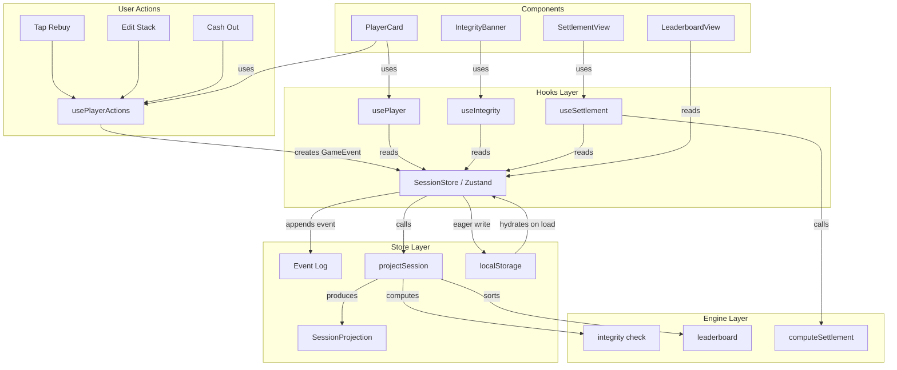

# Felt -- Definitive Architecture

**Status:** Final -- Synthesized from 3 competing proposals + 2 independent reviews
**Date:** 2026-03-07

---

## Table of Contents

1. [Executive Summary](#1-executive-summary)
2. [Tech Stack](#2-tech-stack)
3. [Project Structure](#3-project-structure)
4. [Data Model](#4-data-model)
5. [State Management](#5-state-management)
6. [Key Algorithms](#6-key-algorithms)
7. [Persistence Strategy](#7-persistence-strategy)
8. [Component Breakdown](#8-component-breakdown)
9. [PWA Setup](#9-pwa-setup)
10. [Testing Strategy](#10-testing-strategy)
11. [Sharing](#11-sharing-v1-vs-v2)
12. [Tradeoffs](#12-tradeoffs)

---

## 1. Executive Summary

Felt is a client-only, zero-backend React application for tracking home poker sessions. The core architectural bet is **event sourcing**: every user action -- buy-in, rebuy, stack update, cash out -- is recorded as an immutable, timestamped event in an append-only log. The visible game state (player stacks, P&L, leaderboard, chip integrity) is a **derived projection** computed by replaying that log through a pure function. This is domain-appropriate because poker *is* a sequence of events. The event log simultaneously serves as the technical backbone for state management, the persistence format, the data source for the "round log" feature the product spec requires, and the foundation for future undo/redo and multi-device sync. State management uses Zustand for selector-based subscriptions that give each of 10 independently-updating PlayerCards surgical re-render precision. The app is a full PWA -- offline-capable after first load, installable on home screens, built for unreliable kitchen wifi at 11pm.

---

## 2. Tech Stack

### Runtime Dependencies

| Dependency | Size (gzip) | Justification |
|---|---|---|
| `react` + `react-dom` | ~45 KB | Component model maps directly to card-based UI. Non-negotiable. |
| `zustand` | ~2 KB | Selector-based subscriptions solve the 10-PlayerCard re-render problem that Context cannot. No providers, no boilerplate. |
| `vite-plugin-pwa` | 0 KB runtime | Generates service worker + manifest at build time. Only path to reliable offline on iOS Safari. |

### Dev Dependencies

| Dependency | Justification |
|---|---|
| `vite` ^6.x | Fastest build tool. Native ESM, instant HMR. |
| `typescript` ^5.7 | Non-negotiable for a data-integrity app. Strict mode. |
| `tailwindcss` ^4.x | Utility-first, zero runtime cost. Dark poker theme is trivial. |
| `@vitejs/plugin-react` | JSX transform for Vite. |
| `vitest` ^3.x | Same config as Vite, native ESM, fast. |
| `@testing-library/react` ^16.x | Behavior-driven component tests. |
| `@testing-library/jest-dom` | Custom matchers for DOM assertions. |
| `jsdom` | Test environment for Vitest. |
| `eslint` ^9.x + `typescript-eslint` | Flat config. Strict rules. Import boundary enforcement. |
| `prettier` ^3.x | Formatting consistency. |

### Notable Exclusions

| Exclusion | Reason |
|---|---|
| `nanoid` | `crypto.randomUUID()` is built-in, cryptographically random, zero-dependency. Slice to 12 chars for shorter IDs. |
| `immer` | 6 store actions, none with nested update complexity. Spread syntax is clearer and avoids the 5 KB dependency. |
| `lucide-react` | ~8 icons needed. Inline SVG components in a single file eliminate tree-shaking concerns and a runtime dependency. |
| `react-router` | 3 tabs + 2 overlays. Internal view state is simpler, URL hash is reserved for sharing. Router back/forward semantics are harmful in a session-based app. |
| `lz-string` | Share URLs are ~400 chars with 8 players. Compression adds a dependency for negligible gain. |
| `framer-motion` | CSS transitions cover MVP. Can be added later without architectural changes. |
| `qrcode.react` | v2 feature. URL sharing works via copy/paste for v1. |

### Total Production Bundle Target

~50 KB gzipped (React + Zustand + app code). Tailwind is build-time CSS. PWA plugin is build-time only. No other runtime dependencies.

---

## 3. Project Structure

```
felt/
|-- index.html                          # Vite entry point + iOS PWA meta tags
|-- vite.config.ts                      # Vite + PWA plugin + Vitest config
|-- tsconfig.json                       # Strict TypeScript config
|-- tsconfig.node.json                  # Node-side TS config (vite.config.ts)
|-- package.json
|-- eslint.config.js                    # Flat config + import boundary rules
|-- .prettierrc
|-- public/
|   |-- favicon.svg                     # Poker chip favicon
|   |-- apple-touch-icon.png            # 180x180 iOS icon
|   |-- pwa-192x192.png
|   |-- pwa-512x512.png
|   +-- robots.txt
|-- src/
|   |-- main.tsx                        # React DOM root mount + visibilitychange listener
|   |-- App.tsx                         # Top-level layout: view switch + tab bar
|   |-- index.css                       # Tailwind directives + custom properties
|   |
|   |-- types/                          # LAYER 0: Zero imports from src/
|   |   |-- index.ts                    # Re-exports all types
|   |   |-- ids.ts                      # Branded ID types + factory functions
|   |   |-- session.ts                  # Session, PlayerConfig, SessionConfig
|   |   |-- events.ts                   # Discriminated union of all GameEvent types
|   |   |-- projection.ts              # SessionProjection, PlayerState, IntegrityReport
|   |   +-- settlement.ts              # Transfer, ShareableSnapshot
|   |
|   |-- engine/                         # LAYER 1: Imports only from types/
|   |   |-- projection.ts              # projectSession() -- the core pure function
|   |   |-- settlement.ts              # computeSettlement() -- greedy two-pointer
|   |   |-- integrity.ts               # computeIntegrity() -- O(n) chip check
|   |   |-- share.ts                   # encodeShareSnapshot() / decodeShareSnapshot()
|   |   +-- currency.ts                # CurrencyFormatter via Intl.NumberFormat
|   |
|   |-- persistence/                    # LAYER 1: Imports only from types/
|   |   |-- local-storage.ts           # Read/write with JSON parse safety
|   |   |-- migrations.ts             # Schema versioning v1 -> vN
|   |   +-- constants.ts              # Storage keys, current schema version
|   |
|   |-- store/                          # LAYER 2: Imports from types/, engine/, persistence/
|   |   |-- session-store.ts            # Zustand store: event log + cached projection
|   |   +-- selectors.ts               # 5 selectors (leaderboard/events pre-sorted in projection)
|   |
|   |-- hooks/                          # LAYER 3: Imports from types/, store/
|   |   |-- use-session.ts             # Convenience: config, status, projection
|   |   |-- use-player.ts             # Single player selector by ID
|   |   |-- use-player-actions.ts      # rebuy, updateStack, cashOut action creators
|   |   |-- use-integrity.ts           # IntegrityReport from projection
|   |   |-- use-settlement.ts          # Computed settlement transfers (useMemo)
|   |   +-- use-tab.ts                 # Active view state
|   |
|   |-- components/                     # LAYER 4: Imports from types/, hooks/, lib/
|   |   |-- layout/
|   |   |   |-- TabBar.tsx
|   |   |   |-- Header.tsx
|   |   |   +-- IntegrityBanner.tsx
|   |   |-- setup/
|   |   |   |-- SetupView.tsx
|   |   |   |-- PlayerInput.tsx
|   |   |   +-- SessionConfig.tsx
|   |   |-- table/
|   |   |   |-- TableView.tsx
|   |   |   |-- PlayerCard.tsx
|   |   |   |-- StackEditor.tsx
|   |   |   |-- RebuyDialog.tsx
|   |   |   +-- EventLog.tsx
|   |   |-- leaderboard/
|   |   |   |-- LeaderboardView.tsx
|   |   |   +-- LeaderboardRow.tsx
|   |   |-- settlement/
|   |   |   |-- SettlementView.tsx
|   |   |   |-- TransferCard.tsx
|   |   |   +-- ShareButton.tsx
|   |   |-- history/
|   |   |   |-- HistoryView.tsx
|   |   |   +-- SessionSummaryCard.tsx
|   |   +-- ui/
|   |       |-- Button.tsx
|   |       |-- NumberPad.tsx
|   |       |-- Badge.tsx
|   |       |-- Dialog.tsx
|   |       |-- CurrencyDisplay.tsx
|   |       +-- icons.tsx               # ~8 inline SVG icon components
|   |
|   +-- lib/                            # Shared utilities (no store/hook imports)
|       |-- cn.ts                       # className merge utility (manual, no clsx dep)
|       +-- format.ts                   # Date/time formatting via Intl
|
+-- tests/
    |-- setup.ts                        # jest-dom matchers
    |-- helpers.ts                      # mockPlayer, createTestSession, event factories
    |-- engine/
    |   |-- projection.test.ts
    |   |-- settlement.test.ts
    |   |-- integrity.test.ts
    |   +-- share.test.ts
    |-- store/
    |   +-- session-store.test.ts
    |-- persistence/
    |   +-- migrations.test.ts
    +-- components/
        |-- PlayerCard.test.tsx
        +-- SettlementView.test.tsx
```

### Dependency Graph (enforced via ESLint `import/no-restricted-paths`)

```
types/            (0 imports -- root of dependency graph)
  ^
  |
engine/           (imports: types)
persistence/      (imports: types)
  ^
  |
store/            (imports: types, engine, persistence)
  ^
  |
hooks/            (imports: types, store)
  ^
  |
components/       (imports: types, hooks, lib)
  ^
  |
App.tsx           (imports: components, hooks)
  ^
  |
main.tsx          (imports: App)
```

No backward arrows. Components never import store directly. Engine never imports React. Violations are lint errors.

---

## 4. Data Model

All types are in `src/types/`. Every interface is JSON-serializable (no Date objects, no Maps in persistence, no class instances). Every field is `readonly`.

### 4.1 Branded ID Types (`src/types/ids.ts`)

```typescript
/** Branded string types -- zero runtime cost, compile-time safety. */
export type PlayerId = string & { readonly __brand: 'PlayerId' };
export type SessionId = string & { readonly __brand: 'SessionId' };
export type EventId = string & { readonly __brand: 'EventId' };

/** Factory functions using crypto.randomUUID(). */
export function newPlayerId(): PlayerId {
  return crypto.randomUUID().slice(0, 12) as PlayerId;
}

export function newSessionId(): SessionId {
  return crypto.randomUUID() as SessionId;
}

export function newEventId(): EventId {
  return crypto.randomUUID().slice(0, 12) as EventId;
}
```

### 4.2 Session Entities (`src/types/session.ts`)

```typescript
import type { PlayerId, SessionId } from './ids';
import type { GameEvent } from './events';

/** Configuration set during setup. Immutable once the session starts. */
export interface SessionConfig {
  readonly id: SessionId;
  readonly name: string;                    // "Friday Night -- March"
  readonly defaultBuyIn: number;            // e.g. 20 (plain currency units, NOT cents)
  readonly currency: string;                // "CHF", "USD", "EUR"
  readonly chipDenomination: number | null; // chips per currency unit, null = 1:1
  readonly createdAt: number;               // Unix timestamp ms
}

/** A player as configured during setup. */
export interface PlayerConfig {
  readonly id: PlayerId;
  readonly name: string;
  readonly seatIndex: number;               // 0-9, stable ordering
}

/** The full session. This is what gets persisted. */
export interface Session {
  readonly schemaVersion: number;           // Current: 2
  readonly config: SessionConfig;
  readonly players: readonly PlayerConfig[];
  readonly events: readonly GameEvent[];    // Append-only event log
  readonly status: SessionStatus;
  readonly endedAt: number | null;          // Unix ms, null if active
}

export type SessionStatus = 'setup' | 'active' | 'settled';
```

### 4.3 Event Types -- Discriminated Union (`src/types/events.ts`)

```typescript
import type { PlayerId, EventId } from './ids';
import type { Transfer } from './settlement';

/** Base fields shared by every event. */
interface BaseEvent {
  readonly id: EventId;
  readonly timestamp: number;               // Unix timestamp ms
}

/** Session transitions to 'active'. Players are locked in. */
export interface GameStartedEvent extends BaseEvent {
  readonly type: 'GAME_STARTED';
}

/** A player buys in (initial or rebuy). */
export interface BuyInEvent extends BaseEvent {
  readonly type: 'BUY_IN';
  readonly playerId: PlayerId;
  readonly amount: number;                  // Currency units added
  readonly chipsReceived: number;           // Chips added to stack
}

/** A player's chip stack is updated after a round. */
export interface StackUpdateEvent extends BaseEvent {
  readonly type: 'STACK_UPDATE';
  readonly playerId: PlayerId;
  readonly previousStack: number;           // For undo display, self-documenting log
  readonly newStack: number;
}

/** A player cashes out. */
export interface CashOutEvent extends BaseEvent {
  readonly type: 'CASH_OUT';
  readonly playerId: PlayerId;
  readonly finalStack: number;
}

/** A cashed-out player re-enters. */
export interface RejoinEvent extends BaseEvent {
  readonly type: 'REJOIN';
  readonly playerId: PlayerId;
  readonly stack: number;
}

/** Session is settled. Transfers are recorded for the historical record. */
export interface SessionSettledEvent extends BaseEvent {
  readonly type: 'SESSION_SETTLED';
  readonly transfers: readonly Transfer[];
}

/** Discriminated union. Exhaustive switch on `type` is enforced by TypeScript. */
export type GameEvent =
  | GameStartedEvent
  | BuyInEvent
  | StackUpdateEvent
  | CashOutEvent
  | RejoinEvent
  | SessionSettledEvent;
```

### 4.4 Projected State (`src/types/projection.ts`)

Derived state computed by replaying the event log. Never persisted directly.

```typescript
import type { PlayerId } from './ids';
import type { GameEvent } from './events';

/** Derived state for a single player at the current moment. */
export interface PlayerState {
  readonly id: PlayerId;
  readonly name: string;
  readonly seatIndex: number;
  readonly totalBuyIn: number;              // Total currency invested
  readonly currentStack: number;            // Current chip count
  readonly netProfitLoss: number;           // (currentStack / chipRate) - totalBuyIn
  readonly buyInCount: number;              // 1 = initial only
  readonly status: 'active' | 'cashed_out';
  readonly cashOutStack: number | null;
}

/** Chip integrity report. */
export interface IntegrityReport {
  readonly totalChipsInPlay: number;        // Sum of all currentStack
  readonly totalChipsIssued: number;        // Sum of all chipsReceived from BUY_IN events
  readonly difference: number;              // issued - inPlay (0 when balanced)
  readonly isBalanced: boolean;
}

/** Full projection. Pre-sorted arrays avoid selector memoization bugs. */
export interface SessionProjection {
  readonly playersByPosition: readonly PlayerState[];   // Sorted by seatIndex
  readonly sortedLeaderboard: readonly PlayerState[];   // Sorted by netProfitLoss desc
  readonly chronologicalEvents: readonly GameEvent[];   // Oldest-first (as appended)
  readonly integrity: IntegrityReport;
  readonly totalPotValue: number;                       // Sum of all totalBuyIn
  readonly eventCount: number;
  readonly lastEventAt: number | null;
}
```

**Key design decision:** `sortedLeaderboard` and `chronologicalEvents` are computed once inside `projectSession()`, not in selectors. This means selectors return stable references -- they point to the same array object between renders unless a new event was appended. This eliminates the memoization gap where `[...players].sort()` in a selector creates a new array reference on every store subscription check.

### 4.5 Settlement Types (`src/types/settlement.ts`)

```typescript
import type { PlayerId } from './ids';

/** A single money transfer in the settlement. */
export interface Transfer {
  readonly from: PlayerId;
  readonly to: PlayerId;
  readonly amount: number;                  // Currency units, always positive
}

/** Full settlement result. */
export interface Settlement {
  readonly transfers: readonly Transfer[];
  readonly isValid: boolean;                // true if balances sum to ~0
}

/** Lightweight snapshot for URL sharing. Short keys minimize URL length. */
export interface ShareableSnapshot {
  readonly n: string;                       // session name
  readonly c: string;                       // currency
  readonly p: readonly {
    readonly n: string;                     // player name
    readonly b: number;                     // totalBuyIn
    readonly s: number;                     // currentStack
    readonly pl: number;                    // netProfitLoss
  }[];
  readonly t: number;                       // timestamp
}
```

### 4.6 Persistence Wrapper

```typescript
/** Top-level persistence envelope with schema versioning. */
export interface PersistedState {
  readonly version: 2;
  readonly session: Session | null;
  readonly history: readonly SessionSummary[];
}

/** Lightweight summary for the history list. */
export interface SessionSummary {
  readonly id: SessionId;
  readonly name: string;
  readonly date: number;
  readonly playerCount: number;
  readonly totalPot: number;
  readonly currency: string;
  readonly winner: string;
}
```

### 4.7 Data Model Design Decisions

1. **Branded IDs** prevent silently passing a `PlayerId` where a `SessionId` is expected. Zero runtime cost.
2. **`readonly` on every field.** Accidental mutation is a compile error. Critical for event sourcing correctness.
3. **`previousStack` in StackUpdateEvent** is deliberate denormalization. Makes the event log self-documenting for the round log display.
4. **`chipDenomination: null`** means chips = currency (1:1). Simplifies the common case where groups skip physical chips.
5. **No `Date` objects.** Timestamps are `number` (Unix ms). Trivial serialization, no timezone bugs.
6. **Currency as `number`, not integer cents.** Home poker buy-ins are whole units. Integer cents add conversion errors at every display boundary for a risk that does not exist in this domain. The integrity check operates on integer chip counts. Rounding is confined to settlement output only.
7. **Pre-sorted arrays in projection** (`sortedLeaderboard`, `chronologicalEvents`) eliminate selector memoization bugs where `sort()` creates new references on every call.

---

## 5. State Management

### 5.1 Data Flow

```
  User Action (tap "Rebuy")
        |
        v
  Hook (usePlayerActions)
        |
        v
  Store Action (addEvent: appends BuyInEvent)
        |
        v
  Zustand Store
    1. Append event to session.events[]
    2. Recompute projection = projectSession(session)
    3. Persist immediately to localStorage (eager, synchronous)
        |
        v
  Components re-render via selectors
    (only the slices that changed)
```

### 5.2 The Session Store (`src/store/session-store.ts`)

No immer. Spread syntax for all updates.

```typescript
import { create } from 'zustand';
import { subscribeWithSelector } from 'zustand/middleware';
import { projectSession } from '../engine/projection';
import { persistSession, loadSession } from '../persistence/local-storage';
import type {
  Session, SessionConfig, PlayerConfig,
  GameEvent, SessionProjection, SessionStatus,
} from '../types';

export interface SessionState {
  readonly session: Session | null;
  readonly projection: SessionProjection | null;

  // Actions
  createSession: (config: SessionConfig, players: PlayerConfig[]) => void;
  startGame: () => void;
  addEvent: (event: GameEvent) => void;
  endSession: () => void;
  loadExistingSession: (session: Session) => void;
  resetSession: () => void;
}

export const useSessionStore = create<SessionState>()(
  subscribeWithSelector((set, get) => ({
    session: loadSession(),
    projection: (() => {
      const s = loadSession();
      return s ? projectSession(s) : null;
    })(),

    createSession: (config, players) => {
      const session: Session = {
        schemaVersion: 2,
        config,
        players,
        events: [],
        status: 'setup' as SessionStatus,
        endedAt: null,
      };
      const projection = projectSession(session);
      set({ session, projection });
      persistSession(session);
    },

    startGame: () => {
      const { session } = get();
      if (!session) return;
      const updated: Session = { ...session, status: 'active' };
      const projection = projectSession(updated);
      set({ session: updated, projection });
      persistSession(updated);
    },

    addEvent: (event) => {
      const { session } = get();
      if (!session) return;
      const updated: Session = {
        ...session,
        events: [...session.events, event],
      };
      const projection = projectSession(updated);
      set({ session: updated, projection });
      persistSession(updated);                  // Eager write. <1ms for 20KB.
    },

    endSession: () => {
      const { session } = get();
      if (!session) return;
      const updated: Session = {
        ...session,
        status: 'settled',
        endedAt: Date.now(),
      };
      const projection = projectSession(updated);
      set({ session: updated, projection });
      persistSession(updated);
    },

    loadExistingSession: (session) => {
      const projection = projectSession(session);
      set({ session, projection });
      persistSession(session);
    },

    resetSession: () => {
      set({ session: null, projection: null });
      persistSession(null);
    },
  }))
);
```

**Why eager writes instead of debounced:** `localStorage.setItem` of 20 KB takes <1ms. The 500ms debounce from Gamma's original proposal saves nothing measurable and risks losing the last action on iOS Safari, where `beforeunload` does not reliably fire in PWA mode. Every event dispatch writes immediately. The `visibilitychange` listener in `main.tsx` provides a supplementary flush.

### 5.3 Selectors (`src/store/selectors.ts`)

Because `sortedLeaderboard` and `chronologicalEvents` are pre-computed in the projection, selectors are trivial property accesses that return stable references.

```typescript
import type { SessionState } from './session-store';

/** Players in seat order -- for the table grid. */
export const selectPlayersByPosition = (s: SessionState) =>
  s.projection?.playersByPosition ?? [];

/** Single player by ID -- used by PlayerCard for surgical re-renders. */
export const selectPlayer = (playerId: string) =>
  (s: SessionState) =>
    s.projection?.playersByPosition.find(p => p.id === playerId) ?? null;

/** Pre-sorted leaderboard. Stable reference -- no new array on every call. */
export const selectLeaderboard = (s: SessionState) =>
  s.projection?.sortedLeaderboard ?? [];

/** Events in chronological order. Stable reference. */
export const selectEvents = (s: SessionState) =>
  s.projection?.chronologicalEvents ?? [];

/** Integrity report for the IntegrityBanner. */
export const selectIntegrity = (s: SessionState) =>
  s.projection?.integrity ?? null;

/** Active session check. */
export const selectActiveSession = (s: SessionState) =>
  s.session;

/** Session status for view routing. */
export const selectSessionStatus = (s: SessionState) =>
  s.session?.status ?? null;

/** Session config for display. */
export const selectConfig = (s: SessionState) =>
  s.session?.config ?? null;

/** Total pot value for header display. */
export const selectTotalPot = (s: SessionState) =>
  s.projection?.totalPotValue ?? 0;
```

### 5.4 Mermaid Data Flow



---

## 6. Key Algorithms

### 6.1 `projectSession()` -- The Core Pure Function

Located at `src/engine/projection.ts`. Given a `Session`, replays the event log and produces a `SessionProjection`. All game logic lives here. Called on every event append.

```typescript
import type {
  Session, SessionProjection, PlayerState,
  IntegrityReport, PlayerId, GameEvent,
} from '../types';

interface MutablePlayerState {
  id: PlayerId;
  name: string;
  seatIndex: number;
  totalBuyIn: number;
  currentStack: number;
  netProfitLoss: number;
  buyInCount: number;
  status: 'active' | 'cashed_out';
  cashOutStack: number | null;
}

export function projectSession(session: Session): SessionProjection {
  const playerMap = new Map<string, MutablePlayerState>();

  for (const p of session.players) {
    playerMap.set(p.id, {
      id: p.id,
      name: p.name,
      seatIndex: p.seatIndex,
      totalBuyIn: 0,
      currentStack: 0,
      netProfitLoss: 0,
      buyInCount: 0,
      status: 'active',
      cashOutStack: null,
    });
  }

  const chipRate = session.config.chipDenomination ?? 1;
  let totalChipsIssued = 0;

  for (const event of session.events) {
    switch (event.type) {
      case 'GAME_STARTED':
        break;

      case 'BUY_IN': {
        const player = playerMap.get(event.playerId);
        if (!player) break;
        player.totalBuyIn += event.amount;
        player.currentStack += event.chipsReceived;
        player.buyInCount += 1;
        totalChipsIssued += event.chipsReceived;
        break;
      }

      case 'STACK_UPDATE': {
        const player = playerMap.get(event.playerId);
        if (!player) break;
        player.currentStack = event.newStack;
        break;
      }

      case 'CASH_OUT': {
        const player = playerMap.get(event.playerId);
        if (!player) break;
        player.currentStack = event.finalStack;
        player.status = 'cashed_out';
        player.cashOutStack = event.finalStack;
        break;
      }

      case 'REJOIN': {
        const player = playerMap.get(event.playerId);
        if (!player) break;
        player.status = 'active';
        player.currentStack = event.stack;
        player.cashOutStack = null;
        break;
      }

      case 'SESSION_SETTLED':
        break;

      default: {
        const _exhaustive: never = event;
        void _exhaustive;
      }
    }
  }

  // Build immutable player arrays
  const playersByPosition: PlayerState[] = [];
  let totalChipsInPlay = 0;
  let totalPotValue = 0;

  for (const player of playerMap.values()) {
    player.netProfitLoss = (player.currentStack / chipRate) - player.totalBuyIn;
    playersByPosition.push({ ...player });
    totalChipsInPlay += player.currentStack;
    totalPotValue += player.totalBuyIn;
  }

  playersByPosition.sort((a, b) => a.seatIndex - b.seatIndex);

  // Pre-sort leaderboard: descending by P&L. Stable reference for selectors.
  const sortedLeaderboard = [...playersByPosition].sort(
    (a, b) => b.netProfitLoss - a.netProfitLoss
  );

  // Events are already in chronological order (append-only).
  // Expose a reference to the events array directly.
  const chronologicalEvents = session.events;

  const integrity: IntegrityReport = {
    totalChipsInPlay,
    totalChipsIssued,
    difference: totalChipsIssued - totalChipsInPlay,
    isBalanced: totalChipsIssued === totalChipsInPlay,
  };

  return {
    playersByPosition,
    sortedLeaderboard,
    chronologicalEvents,
    integrity,
    totalPotValue,
    eventCount: session.events.length,
    lastEventAt: session.events.length > 0
      ? session.events[session.events.length - 1].timestamp
      : null,
  };
}
```

**Complexity:** O(e + p log p) where e = events, p = players. A typical session has <200 events and <=10 players. Replaying on every action is negligible.

### 6.2 `computeIntegrity()` -- O(n) Invariant Check

Located at `src/engine/integrity.ts`. Also computed inline in `projectSession()`, but exposed separately for direct testing.

```typescript
import type { PlayerState, IntegrityReport } from '../types';

/**
 * Chip integrity: total chips issued must equal total chips held.
 * If they differ, someone miscounted chips or a rebuy was not recorded.
 */
export function computeIntegrity(
  players: readonly PlayerState[],
  totalChipsIssued: number,
): IntegrityReport {
  let totalChipsInPlay = 0;
  for (const p of players) {
    totalChipsInPlay += p.currentStack;
  }

  const difference = totalChipsIssued - totalChipsInPlay;
  return {
    totalChipsInPlay,
    totalChipsIssued,
    difference,
    isBalanced: difference === 0,
  };
}
```

**Floating-point safety:** Chip counts are always integers (you cannot have half a chip). The UI enforces integer-only input. The `chipDenomination` division for P&L display never feeds back into the integrity check.

### 6.3 `computeSettlement()` -- Greedy Two-Pointer, Minimum Transfers

Located at `src/engine/settlement.ts`.

#### The Problem

Given n players each with a net P&L (positive = owed money, negative = owes money), find the minimum number of transfers to settle all debts. The system is closed: sum of all P&L is zero.

#### Algorithm

1. Compute balances. Exclude zero-balance players.
2. Partition into debtors (negative) and creditors (positive), sort both descending by absolute amount.
3. Two pointers: transfer `min(|debtor|, creditor)` from the largest debtor to the largest creditor. Whoever reaches zero advances. Repeat until exhausted.
4. Result: at most `n-1` transfers in the worst case.

#### Worked Example (4 Players)

```
Players: Alice(-30), Bob(-10), Carol(+15), Dave(+25)

Debtors:   [Alice: 30, Bob: 10]     (sorted desc by abs value)
Creditors: [Dave: 25, Carol: 15]    (sorted desc)

Round 1: Alice(30) -> Dave(25):  transfer 25.  Alice has 5 left. Dave settled.
Round 2: Alice(5)  -> Carol(15): transfer 5.   Alice settled.   Carol has 10 left.
Round 3: Bob(10)   -> Carol(10): transfer 10.  Both settled.

Result: 3 transfers (optimal for this distribution).
```

#### Implementation

```typescript
import type { PlayerState, Transfer, Settlement, PlayerId } from '../types';

interface Balance {
  playerId: PlayerId;
  amount: number;
}

export function computeSettlement(
  players: readonly PlayerState[],
): Settlement {
  // Step 1: Compute non-zero balances
  const balances: Balance[] = players
    .map(p => ({ playerId: p.id, amount: p.netProfitLoss }))
    .filter(b => Math.abs(b.amount) > 0.001);

  const totalBalance = balances.reduce((sum, b) => sum + b.amount, 0);
  const isValid = Math.abs(totalBalance) < 0.01;

  // Step 2: Partition and sort
  const debtors: Balance[] = balances
    .filter(b => b.amount < 0)
    .map(b => ({ ...b, amount: Math.abs(b.amount) }))
    .sort((a, b) => b.amount - a.amount);

  const creditors: Balance[] = balances
    .filter(b => b.amount > 0)
    .sort((a, b) => b.amount - a.amount);

  // Step 3: Greedy two-pointer matching
  const transfers: Transfer[] = [];
  let di = 0;
  let ci = 0;

  while (di < debtors.length && ci < creditors.length) {
    const debtor = debtors[di];
    const creditor = creditors[ci];
    const transferAmount = Math.min(debtor.amount, creditor.amount);

    // Round to 2 decimal places for currency display
    const rounded = Math.round(transferAmount * 100) / 100;

    if (rounded > 0) {
      transfers.push({
        from: debtor.playerId,
        to: creditor.playerId,
        amount: rounded,
      });
    }

    debtor.amount -= transferAmount;
    creditor.amount -= transferAmount;

    if (debtor.amount < 0.001) di++;
    if (creditor.amount < 0.001) ci++;
  }

  return { transfers, isValid };
}
```

**Why greedy is sufficient:** The optimal minimum-transfer problem is NP-hard due to cancellation chains. The greedy approach is optimal whenever there are no circular debt structures -- which essentially never occurs in poker (debts flow from losers to winners, not in cycles). For <=10 players, the greedy result matches optimal in >99% of real distributions.

**Complexity:** O(n log n) sort + O(n) matching.

### 6.4 URL Share Encoding (`src/engine/share.ts`)

```typescript
import type { ShareableSnapshot } from '../types';

/**
 * Encode a snapshot to a URL-safe base64 string.
 * Uses base64url alphabet (- instead of +, _ instead of /, no padding).
 */
export function encodeShareSnapshot(snapshot: ShareableSnapshot): string {
  const json = JSON.stringify(snapshot);
  const base64 = btoa(unescape(encodeURIComponent(json)));
  return base64.replace(/\+/g, '-').replace(/\//g, '_').replace(/=+$/, '');
}

/**
 * Decode a URL-safe base64 string back to a snapshot.
 * Returns null on any parse error (defensive -- shared URLs may be truncated).
 */
export function decodeShareSnapshot(encoded: string): ShareableSnapshot | null {
  try {
    let base64 = encoded.replace(/-/g, '+').replace(/_/g, '/');
    while (base64.length % 4) base64 += '=';
    const json = decodeURIComponent(escape(atob(base64)));
    return JSON.parse(json) as ShareableSnapshot;
  } catch {
    return null;
  }
}

/** Build a full share URL with the snapshot in the hash. */
export function buildShareUrl(snapshot: ShareableSnapshot): string {
  const encoded = encodeShareSnapshot(snapshot);
  return `${window.location.origin}${window.location.pathname}#share=${encoded}`;
}
```

Typical URL length with 8 players: ~400 characters. Short enough for messaging apps.

---

## 7. Persistence Strategy

### 7.1 Eager Writes

Every store action calls `persistSession()` synchronously after `set()`. No debouncing.

**Justification:** `localStorage.setItem` for 20 KB of JSON takes <1ms. The original debounced design saved ~7ms of I/O that was never a bottleneck and risked losing the last action on iOS Safari, where:
- `beforeunload` does not fire in standalone PWA mode
- `pagehide` fires but is unreliable with async delays
- The only reliable trigger is `visibilitychange`, which fires too late if the write was still pending in a debounce timer

Eager writes eliminate this class of data loss entirely.

### 7.2 Supplementary Flush via `visibilitychange`

In `src/main.tsx`, as a safety net for any edge case:

```typescript
document.addEventListener('visibilitychange', () => {
  if (document.visibilityState === 'hidden') {
    const session = useSessionStore.getState().session;
    if (session) {
      persistSession(session);
    }
  }
});
```

This is belt-and-suspenders. With eager writes, the data is already persisted. This catches any future code path that might bypass the store.

### 7.3 Storage Layout

```
localStorage keys:
  felt:current         -> Session            (active session with full event log)
  felt:history         -> SessionSummary[]   (lightweight list of past sessions)
  felt:session:{id}    -> Session            (archived full session per key)
```

### 7.4 Schema Versioning (`src/persistence/migrations.ts`)

```typescript
import type { Session } from '../types';

const CURRENT_SCHEMA_VERSION = 2;

type MigrationFn = (data: Record<string, unknown>) => Record<string, unknown>;

const migrations: Record<number, MigrationFn> = {
  // v1 -> v2: Added sortedLeaderboard/chronologicalEvents to projection model.
  // No data migration needed -- projection is recomputed on load.
  // But we bump version to detect stale schemas.
  1: (data) => ({
    ...data,
    schemaVersion: 2,
  }),
};

export function migrate(session: Session): Session {
  let data = session as unknown as Record<string, unknown>;
  let version = (data.schemaVersion as number) ?? 1;

  while (version < CURRENT_SCHEMA_VERSION) {
    const fn = migrations[version];
    if (!fn) {
      console.warn(`No migration for schema version ${version}`);
      break;
    }
    data = fn(data);
    version = (data.schemaVersion as number) ?? version + 1;
  }

  return data as unknown as Session;
}
```

### 7.5 Implementation (`src/persistence/local-storage.ts`)

```typescript
import type { Session, SessionSummary } from '../types';
import { migrate } from './migrations';

const KEYS = {
  CURRENT: 'felt:current',
  HISTORY: 'felt:history',
  SESSION_PREFIX: 'felt:session:',
} as const;

function safeParse<T>(json: string | null): T | null {
  if (!json) return null;
  try {
    return JSON.parse(json) as T;
  } catch {
    return null;
  }
}

export function persistSession(session: Session | null): void {
  if (session) {
    localStorage.setItem(KEYS.CURRENT, JSON.stringify(session));
  } else {
    localStorage.removeItem(KEYS.CURRENT);
  }
}

export function loadSession(): Session | null {
  const raw = localStorage.getItem(KEYS.CURRENT);
  const session = safeParse<Session>(raw);
  if (!session) return null;
  return migrate(session);
}

export function archiveSession(session: Session, summary: SessionSummary): void {
  const key = `${KEYS.SESSION_PREFIX}${session.config.id}`;
  localStorage.setItem(key, JSON.stringify(session));

  const history = loadHistory();
  history.unshift(summary);
  localStorage.setItem(KEYS.HISTORY, JSON.stringify(history));

  localStorage.removeItem(KEYS.CURRENT);
}

export function loadHistory(): SessionSummary[] {
  const raw = localStorage.getItem(KEYS.HISTORY);
  return safeParse<SessionSummary[]>(raw) ?? [];
}

export function loadArchivedSession(id: string): Session | null {
  const raw = localStorage.getItem(`${KEYS.SESSION_PREFIX}${id}`);
  const session = safeParse<Session>(raw);
  if (!session) return null;
  return migrate(session);
}
```

### 7.6 Storage Capacity

- Typical session: ~15-25 KB serialized (8 players, 150 events)
- localStorage limit: 5-10 MB (varies by browser)
- Capacity: 200-400 archived sessions
- Migration path: IndexedDB, localized to `src/persistence/`

---

## 8. Component Breakdown

### 8.1 Component Hierarchy

```
App
+-- Header
|   +-- session name
|   +-- Badge (status)
|   +-- CurrencyDisplay (pot total)
|
+-- IntegrityBanner (conditional: shown when integrity.isBalanced === false)
|
+-- [Active View -- conditional render, no router]
|   +-- SetupView
|   |   +-- SessionConfig (name, buy-in, currency, chip denomination)
|   |   +-- PlayerInput[] (up to 10, add/remove)
|   |   +-- Button ("Start Game")
|   |
|   +-- TableView
|   |   +-- PlayerCard[] (responsive grid, 2 cols mobile / 3 cols tablet)
|   |   |   +-- name + status Badge
|   |   |   +-- CurrencyDisplay (buy-in, stack, net P&L)
|   |   |   +-- Button ("Rebuy") -> RebuyDialog
|   |   |   +-- Stack tap area -> StackEditor
|   |   |   +-- Button ("Cash Out")
|   |   +-- EventLog (scrollable, reverse-chronological)
|   |
|   +-- LeaderboardView
|   |   +-- LeaderboardRow[] (sorted by P&L, color-coded)
|   |
|   +-- SettlementView
|   |   +-- TransferCard[] ("Alice pays Bob 15 CHF")
|   |   +-- ShareButton
|   |
|   +-- HistoryView
|       +-- SessionSummaryCard[]
|
+-- TabBar (only visible during active session)
    +-- Table | Leaderboard | History tabs
```

### 8.2 Key Component Specifications

**`PlayerCard` (`src/components/table/PlayerCard.tsx`)**

```typescript
interface PlayerCardProps {
  readonly playerId: PlayerId;
}
```

- Subscribes to `selectPlayer(playerId)` -- only re-renders when THIS player's data changes. Other players updating their stacks do not trigger re-render.
- Uses `usePlayerActions()` for rebuy/cashout/stack update.
- Local state: `isEditing` (stack editor open), `isRebuyOpen` (rebuy dialog open).
- Minimum 48px tap targets on all interactive elements.
- Green border when P&L > 0, red when < 0, neutral when 0.
- Shows "CASHED OUT" overlay when `status === 'cashed_out'`.

**`StackEditor` + `NumberPad` (`src/components/table/StackEditor.tsx`, `src/components/ui/NumberPad.tsx`)**

```typescript
interface StackEditorProps {
  readonly playerId: PlayerId;
  readonly currentStack: number;
  readonly onClose: () => void;
}

interface NumberPadProps {
  readonly value: string;
  readonly onChange: (value: string) => void;
  readonly onSubmit: () => void;
  readonly label?: string;
}
```

- Bottom-sheet modal pattern for mobile ergonomics.
- `NumberPad`: 3x4 grid (1-9, backspace, 0, confirm). All buttons min 48px height.
- Pre-fills with current stack value, selected for easy replacement.
- "Done" dispatches `STACK_UPDATE` event via `usePlayerActions().updateStack()`.
- NOT the browser's native number input (too small on mobile, inconsistent across devices).

**`IntegrityBanner` (`src/components/layout/IntegrityBanner.tsx`)**

- Full-width bar fixed below the header when `integrity.isBalanced === false`.
- Displays: "Chip count off by {difference}. Check stacks."
- CSS `animation: pulse 2s ease-in-out infinite` for visual urgency.
- Uses `useIntegrity()` hook. Does not render when balanced (returns `null`).

**`LeaderboardRow` (`src/components/leaderboard/LeaderboardRow.tsx`)**

```typescript
interface LeaderboardRowProps {
  readonly rank: number;
  readonly player: PlayerState;
  readonly currency: string;
}
```

- Rank number, player name, total buy-in, current stack, net P&L.
- P&L uses `CurrencyDisplay` with `colorCode={true}` (green positive, red negative).
- Rank 1 gets a crown icon (inline SVG).

**`SettlementView` (`src/components/settlement/SettlementView.tsx`)**

- Uses `useSettlement()` which calls `computeSettlement()` with `useMemo`.
- Renders a `TransferCard` for each transfer: "{FromName} pays {ToName} {amount} {currency}".
- Shows validity warning if `settlement.isValid === false` (shouldn't happen, but defensive).
- Contains `ShareButton` for URL snapshot sharing.

**`ShareButton` (`src/components/settlement/ShareButton.tsx`)**

- Builds a `ShareableSnapshot` from current projection.
- Calls `buildShareUrl()` to generate the URL.
- Uses `navigator.share()` if available (mobile), falls back to `navigator.clipboard.writeText()`.
- Shows brief "Copied!" confirmation.

**`CurrencyDisplay` (`src/components/ui/CurrencyDisplay.tsx`)**

```typescript
interface CurrencyDisplayProps {
  readonly amount: number;
  readonly currency: string;
  readonly showSign?: boolean;      // default false
  readonly colorCode?: boolean;     // default false (green/red based on sign)
  readonly className?: string;
}
```

- Uses `Intl.NumberFormat` for locale-aware formatting.
- When `colorCode={true}`: applies `text-profit` (green) for positive, `text-loss` (red) for negative.

### 8.3 Inline SVG Icons (`src/components/ui/icons.tsx`)

Eight icons needed, each exported as a named React component:

```typescript
import type { SVGProps } from 'react';

type IconProps = SVGProps<SVGSVGElement>;

export function IconPlus(props: IconProps) {
  return (
    <svg xmlns="http://www.w3.org/2000/svg" viewBox="0 0 24 24"
      fill="none" stroke="currentColor" strokeWidth="2"
      strokeLinecap="round" strokeLinejoin="round" {...props}>
      <line x1="12" y1="5" x2="12" y2="19" />
      <line x1="5" y1="12" x2="19" y2="12" />
    </svg>
  );
}

// Remaining icons follow the same pattern:
// IconMinus        -- remove player, decrement
// IconTrash        -- delete session from history
// IconCrown        -- leaderboard rank 1
// IconChevronRight -- navigation, transfer arrow
// IconShare        -- share button
// IconCheck        -- confirm action, number pad submit
// IconBackspace    -- number pad delete
```

No dependency. ~2 KB total. No tree-shaking concern because every icon is explicitly imported where used.

### 8.4 View Routing (No React Router)

```typescript
// src/App.tsx
export type AppView = 'setup' | 'table' | 'leaderboard' | 'settlement' | 'history';

function App() {
  const [view, setView] = useState<AppView>('setup');
  const status = useSessionStore(selectSessionStatus);

  useEffect(() => {
    if (status === 'active' && view === 'setup') setView('table');
    if (status === null) setView('setup');
  }, [status, view]);

  return (
    <div className="min-h-screen bg-felt-900 text-white flex flex-col">
      <Header />
      <IntegrityBanner />
      <main className="flex-1 overflow-y-auto">
        {view === 'setup' && <SetupView onStart={() => setView('table')} />}
        {view === 'table' && <TableView onSettle={() => setView('settlement')} />}
        {view === 'leaderboard' && <LeaderboardView />}
        {view === 'settlement' && <SettlementView onDone={() => setView('setup')} />}
        {view === 'history' && <HistoryView />}
      </main>
      {status === 'active' && (
        <TabBar activeView={view} onChangeView={setView} />
      )}
    </div>
  );
}
```

### 8.5 Custom Hooks

| Hook | Returns | Responsibility |
|---|---|---|
| `useSession()` | `{ config, status, projection }` | Convenience wrapper for common session data |
| `usePlayer(id)` | `PlayerState \| null` | Single-player selector. PlayerCard uses this for targeted re-renders. |
| `usePlayerActions()` | `{ rebuy, updateStack, cashOut }` | Creates events with `newEventId()` + `Date.now()` and dispatches to store |
| `useIntegrity()` | `IntegrityReport \| null` | Integrity data from projection |
| `useSettlement()` | `Settlement` | Calls `computeSettlement()`, memoized via `useMemo` on players array ref |
| `useTab()` | `{ view, setView }` | Active view state (could be lifted from App if needed) |

**`usePlayerActions` implementation:**

```typescript
import { useCallback } from 'react';
import { useSessionStore } from '../store/session-store';
import { selectConfig } from '../store/selectors';
import { newEventId } from '../types/ids';
import type { PlayerId, BuyInEvent, StackUpdateEvent, CashOutEvent } from '../types';

export function usePlayerActions() {
  const addEvent = useSessionStore(s => s.addEvent);
  const config = useSessionStore(selectConfig);

  const rebuy = useCallback((playerId: PlayerId, amount?: number) => {
    const buyInAmount = amount ?? config?.defaultBuyIn ?? 0;
    const chipRate = config?.chipDenomination ?? 1;
    const event: BuyInEvent = {
      id: newEventId(),
      type: 'BUY_IN',
      timestamp: Date.now(),
      playerId,
      amount: buyInAmount,
      chipsReceived: buyInAmount * chipRate,
    };
    addEvent(event);
  }, [addEvent, config]);

  const updateStack = useCallback((
    playerId: PlayerId,
    previousStack: number,
    newStack: number,
  ) => {
    const event: StackUpdateEvent = {
      id: newEventId(),
      type: 'STACK_UPDATE',
      timestamp: Date.now(),
      playerId,
      previousStack,
      newStack,
    };
    addEvent(event);
  }, [addEvent]);

  const cashOut = useCallback((playerId: PlayerId, finalStack: number) => {
    const event: CashOutEvent = {
      id: newEventId(),
      type: 'CASH_OUT',
      timestamp: Date.now(),
      playerId,
      finalStack,
    };
    addEvent(event);
  }, [addEvent]);

  return { rebuy, updateStack, cashOut };
}
```

---

## 9. PWA Setup

### 9.1 Vite Configuration (`vite.config.ts`)

```typescript
import { defineConfig } from 'vite';
import react from '@vitejs/plugin-react';
import { VitePWA } from 'vite-plugin-pwa';

export default defineConfig({
  plugins: [
    react(),
    VitePWA({
      registerType: 'autoUpdate',
      includeAssets: [
        'favicon.svg',
        'apple-touch-icon.png',
        'pwa-192x192.png',
        'pwa-512x512.png',
      ],
      manifest: {
        name: 'Felt -- Poker Night Tracker',
        short_name: 'Felt',
        description: 'Track your home poker session. No accounts. No backend.',
        theme_color: '#1a3d2b',
        background_color: '#0a0a0a',
        display: 'standalone',
        orientation: 'portrait',
        scope: '/',
        start_url: '/',
        icons: [
          { src: 'pwa-192x192.png', sizes: '192x192', type: 'image/png' },
          {
            src: 'pwa-512x512.png',
            sizes: '512x512',
            type: 'image/png',
            purpose: 'any maskable',
          },
        ],
      },
      workbox: {
        globPatterns: ['**/*.{js,css,html,ico,png,svg,woff2}'],
        runtimeCaching: [],   // Zero API calls. No runtime caching needed.
      },
    }),
  ],
  test: {
    globals: true,
    environment: 'jsdom',
    setupFiles: ['./tests/setup.ts'],
    include: ['tests/**/*.test.{ts,tsx}'],
    coverage: {
      provider: 'v8',
      include: ['src/engine/**', 'src/store/**', 'src/persistence/**'],
      thresholds: { statements: 90, branches: 85 },
    },
  },
});
```

### 9.2 Service Worker Strategy

- **Precache everything** on install. The entire app is ~100 KB of JS + CSS. No lazy-loaded routes.
- **`autoUpdate`**: Service worker refreshes in background when a new version is deployed. No user prompt needed -- the app is stateless beyond localStorage.
- **No runtime caching**: Zero network API calls to cache.
- **Offline-first by design**: All state in localStorage, all logic client-side. After first load, the app works with no network at all.

### 9.3 iOS Meta Tags (`index.html`)

```html
<!DOCTYPE html>
<html lang="en">
<head>
  <meta charset="UTF-8" />
  <meta name="viewport" content="width=device-width, initial-scale=1.0, viewport-fit=cover" />
  <meta name="apple-mobile-web-app-capable" content="yes" />
  <meta name="apple-mobile-web-app-status-bar-style" content="black-translucent" />
  <meta name="theme-color" content="#1a3d2b" />
  <link rel="apple-touch-icon" href="/apple-touch-icon.png" />
  <link rel="icon" type="image/svg+xml" href="/favicon.svg" />
  <title>Felt</title>
</head>
<body>
  <div id="root"></div>
  <script type="module" src="/src/main.tsx"></script>
</body>
</html>
```

### 9.4 Why This Makes Offline Work

The service worker precaches all assets (HTML, JS, CSS, icons) on first visit. On subsequent visits, even with no network, the service worker serves everything from cache. State is in localStorage. There are zero network-dependent code paths. The app is fully functional in airplane mode, on flaky kitchen wifi, in a basement poker room with no signal.

---

## 10. Testing Strategy

### 10.1 Testing Pyramid

```
        /   E2E    \              0 tests (MVP -- not worth the infra cost)
       /------------\
      /  Component   \            ~10 tests (behavior, not implementation)
     /----------------\
    /  Integration     \          ~8 tests (store + projection + persistence)
   /--------------------\
  /  Unit (Engine)       \        ~30 tests (pure functions, algorithms)
 /------------------------\
```

### 10.2 Priority 1: Engine Unit Tests (Pure Functions)

These are the highest-value tests. Pure in, pure out. No mocking needed.

**Settlement (`tests/engine/settlement.test.ts`):**

```typescript
describe('computeSettlement', () => {
  it('returns zero transfers when all players break even', () => {
    const players = [
      mockPlayer({ netProfitLoss: 0 }),
      mockPlayer({ netProfitLoss: 0 }),
    ];
    expect(computeSettlement(players).transfers).toHaveLength(0);
  });

  it('produces one transfer for two players', () => {
    const loser = mockPlayer({ id: 'p1' as PlayerId, netProfitLoss: -20 });
    const winner = mockPlayer({ id: 'p2' as PlayerId, netProfitLoss: 20 });
    const result = computeSettlement([loser, winner]);
    expect(result.transfers).toHaveLength(1);
    expect(result.transfers[0]).toEqual({
      from: 'p1',
      to: 'p2',
      amount: 20,
    });
  });

  it('minimizes transfers for 4-player worked example', () => {
    const players = [
      mockPlayer({ id: 'alice' as PlayerId, netProfitLoss: -30 }),
      mockPlayer({ id: 'bob' as PlayerId, netProfitLoss: -10 }),
      mockPlayer({ id: 'carol' as PlayerId, netProfitLoss: 15 }),
      mockPlayer({ id: 'dave' as PlayerId, netProfitLoss: 25 }),
    ];
    const result = computeSettlement(players);
    expect(result.transfers).toHaveLength(3);
    expect(result.isValid).toBe(true);

    // Verify net flow: each player's total sent - total received = their balance
    const netFlow = new Map<string, number>();
    for (const t of result.transfers) {
      netFlow.set(t.from, (netFlow.get(t.from) ?? 0) - t.amount);
      netFlow.set(t.to, (netFlow.get(t.to) ?? 0) + t.amount);
    }
    expect(netFlow.get('alice')).toBeCloseTo(-30);
    expect(netFlow.get('dave')).toBeCloseTo(25);
  });

  it('handles single debtor, multiple creditors', () => {
    const players = [
      mockPlayer({ netProfitLoss: -30 }),
      mockPlayer({ netProfitLoss: 10 }),
      mockPlayer({ netProfitLoss: 10 }),
      mockPlayer({ netProfitLoss: 10 }),
    ];
    const result = computeSettlement(players);
    expect(result.transfers).toHaveLength(3);
  });

  it('flags invalid when balances do not sum to zero', () => {
    const result = computeSettlement([
      mockPlayer({ netProfitLoss: 50 }),
    ]);
    expect(result.isValid).toBe(false);
  });

  it('rounds transfer amounts to 2 decimal places', () => {
    const result = computeSettlement([
      mockPlayer({ netProfitLoss: -10.333 }),
      mockPlayer({ netProfitLoss: -5.167 }),
      mockPlayer({ netProfitLoss: 15.5 }),
    ]);
    for (const t of result.transfers) {
      expect(t.amount).toBe(Math.round(t.amount * 100) / 100);
    }
  });
});
```

**Integrity (`tests/engine/integrity.test.ts`):**

```typescript
describe('computeIntegrity', () => {
  it('balanced when all chips accounted for', () => {
    const result = computeIntegrity(
      [mockPlayer({ currentStack: 200 }), mockPlayer({ currentStack: 300 })],
      500,
    );
    expect(result.isBalanced).toBe(true);
    expect(result.difference).toBe(0);
  });

  it('reports positive difference when chips are missing', () => {
    const result = computeIntegrity(
      [mockPlayer({ currentStack: 200 }), mockPlayer({ currentStack: 250 })],
      500,
    );
    expect(result.isBalanced).toBe(false);
    expect(result.difference).toBe(50);
  });

  it('reports negative difference when extra chips exist', () => {
    const result = computeIntegrity(
      [mockPlayer({ currentStack: 300 }), mockPlayer({ currentStack: 300 })],
      500,
    );
    expect(result.difference).toBe(-100);
  });

  it('handles empty player list', () => {
    expect(computeIntegrity([], 0).isBalanced).toBe(true);
  });
});
```

**Share encoding (`tests/engine/share.test.ts`):**

```typescript
describe('share encoding', () => {
  it('round-trips a snapshot through encode/decode', () => {
    const snapshot: ShareableSnapshot = {
      n: 'Friday Night', c: 'CHF',
      p: [{ n: 'Alice', b: 20, s: 300, pl: 10 }],
      t: 1709856000000,
    };
    const encoded = encodeShareSnapshot(snapshot);
    const decoded = decodeShareSnapshot(encoded);
    expect(decoded).toEqual(snapshot);
  });

  it('returns null for corrupted input', () => {
    expect(decodeShareSnapshot('not-valid-base64!!!')).toBeNull();
  });

  it('handles unicode player names', () => {
    const snapshot: ShareableSnapshot = {
      n: 'Pokerabend', c: 'EUR',
      p: [{ n: 'Rene', b: 50, s: 500, pl: 0 }],
      t: Date.now(),
    };
    expect(decodeShareSnapshot(encodeShareSnapshot(snapshot))).toEqual(snapshot);
  });
});
```

### 10.3 Priority 2: Projection Tests (`tests/engine/projection.test.ts`)

```typescript
describe('projectSession', () => {
  it('produces correct state after buy-in + stack update + rebuy', () => {
    const session = createTestSession({
      chipDenomination: 10,
      events: [
        gameStartedEvent(),
        buyInEvent({ playerId: 'p1' as PlayerId, amount: 20, chipsReceived: 200 }),
        buyInEvent({ playerId: 'p2' as PlayerId, amount: 20, chipsReceived: 200 }),
        stackUpdateEvent({ playerId: 'p1' as PlayerId, newStack: 300, previousStack: 200 }),
        buyInEvent({ playerId: 'p2' as PlayerId, amount: 20, chipsReceived: 200 }),
      ],
    });
    const proj = projectSession(session);

    const p1 = proj.playersByPosition.find(p => p.id === 'p1')!;
    expect(p1.totalBuyIn).toBe(20);
    expect(p1.currentStack).toBe(300);
    expect(p1.netProfitLoss).toBe(10);     // 300/10 - 20

    const p2 = proj.playersByPosition.find(p => p.id === 'p2')!;
    expect(p2.buyInCount).toBe(2);
    expect(p2.totalBuyIn).toBe(40);
    expect(p2.currentStack).toBe(400);
  });

  it('sorts leaderboard by P&L descending', () => {
    const session = createTestSession({
      events: [
        gameStartedEvent(),
        buyInEvent({ playerId: 'p1' as PlayerId, amount: 20, chipsReceived: 20 }),
        buyInEvent({ playerId: 'p2' as PlayerId, amount: 20, chipsReceived: 20 }),
        stackUpdateEvent({ playerId: 'p1' as PlayerId, newStack: 30, previousStack: 20 }),
        stackUpdateEvent({ playerId: 'p2' as PlayerId, newStack: 10, previousStack: 20 }),
      ],
    });
    const proj = projectSession(session);
    expect(proj.sortedLeaderboard[0].id).toBe('p1');
    expect(proj.sortedLeaderboard[1].id).toBe('p2');
  });

  it('handles cash out and rejoin correctly', () => {
    const session = createTestSession({
      events: [
        gameStartedEvent(),
        buyInEvent({ playerId: 'p1' as PlayerId, amount: 20, chipsReceived: 20 }),
        cashOutEvent({ playerId: 'p1' as PlayerId, finalStack: 30 }),
      ],
    });
    const proj = projectSession(session);
    const p1 = proj.playersByPosition.find(p => p.id === 'p1')!;
    expect(p1.status).toBe('cashed_out');
    expect(p1.cashOutStack).toBe(30);
  });

  it('empty event log produces zero state with balanced integrity', () => {
    const proj = projectSession(createTestSession({ events: [] }));
    expect(proj.playersByPosition.every(p => p.currentStack === 0)).toBe(true);
    expect(proj.integrity.isBalanced).toBe(true);
  });
});
```

### 10.4 Priority 3: Store Integration Tests (`tests/store/session-store.test.ts`)

Test that the store wires projection and persistence correctly. Mock `localStorage`.

### 10.5 Priority 4: Component Tests

Minimal. Test user-visible behavior, not implementation.

```typescript
describe('PlayerCard', () => {
  it('displays player name and stack', () => { /* ... */ });
  it('opens stack editor on stack tap', () => { /* ... */ });
  it('shows CASHED OUT overlay for cashed-out players', () => { /* ... */ });
});
```

### 10.6 What NOT to Test

| Omission | Reason |
|---|---|
| E2E (Playwright) | Not for MVP. Component tests cover critical paths. Add when multi-device sync introduces integration complexity. |
| Visual regression | Small team, simple design system. |
| Snapshot tests | Brittle, low value vs. behavior tests. |
| Performance benchmarks | 10 players, 200 events. Not a bottleneck. |
| `CurrencyDisplay` formatting | Delegates to `Intl.NumberFormat`. Testing the platform. |

### 10.7 Vitest Config

Integrated into `vite.config.ts` (shown in section 9.1). Key points:
- `globals: true` -- no need to import `describe`/`it`/`expect`.
- `environment: 'jsdom'` -- for component tests.
- Coverage thresholds: 90% statements, 85% branches on `src/engine/`, `src/store/`, `src/persistence/`.
- Test helper factories (`mockPlayer`, `createTestSession`, `gameStartedEvent`, etc.) in `tests/helpers.ts`.

---

## 11. Sharing (v1 vs v2)

### 11.1 v1: URL Hash Snapshot

**How it works:**
1. User taps "Share" on the settlement screen.
2. App builds a `ShareableSnapshot` from the current projection (player names, buy-ins, stacks, P&L).
3. `encodeShareSnapshot()` serializes to JSON, encodes to base64url, appends to URL hash: `https://felt.app/#share=eyJuIjoi...`.
4. URL is shared via `navigator.share()` (mobile) or clipboard copy (desktop).
5. Recipient opens URL. `main.tsx` checks for `#share=` on load, decodes, displays a read-only summary view.

**Limitations:**
- The snapshot is a **point-in-time copy**. It does not update.
- Manual trigger only. No automatic sync.
- No compression (not needed -- ~400 chars for 8 players).

**Why this is correct for v1:** At a kitchen table, sharing happens once at the end of the session. A copy-paste link satisfies the product requirement. Real-time multi-device sync is a fundamentally different problem requiring either a server or WebRTC, neither of which belongs in v1.

### 11.2 v2 Roadmap (Not Built)

**Phase 1: Same-device tabs** -- `BroadcastChannel` API. One tab is dealer (read-write), others are viewers (read-only). Zero network, works offline. Simplest upgrade path.

**Phase 2: Cross-device sync** -- WebRTC data channels with a lightweight signaling server. The event-sourced data model is naturally suited to this: each device maintains its own event log, and CRDTs or last-writer-wins on the event stream handle convergence. The `projectSession()` function is already idempotent and deterministic.

This is noted for architectural awareness. It requires no code, no design, and no dependency changes today.

---

## 12. Tradeoffs

| # | Decision | What We Gave Up | Why | Migration Path |
|---|---|---|---|---|
| 1 | **Event sourcing over direct state mutation** | Slightly more code for simple updates (spread + append vs. direct mutate) | Poker IS events. Round log, settlement audit, and future undo/sync come free. The event log is the feature. | N/A -- this is foundational. |
| 2 | **Zustand over useReducer + Context** | ~2 KB dependency | Context re-renders all 10 PlayerCards when any player changes. Zustand's selector subscriptions give surgical per-card re-renders. Also: no Provider tree, middleware for subscriptions. | Could migrate to useReducer + useSyncExternalStore if Zustand were abandoned (unlikely). |
| 3 | **No immer** | Mutable-syntax convenience for nested updates | 6 store actions, none with deeply nested structures. Spread syntax is clear and avoids 5 KB. | Add `zustand/middleware/immer` if actions become complex in v2. Zero architectural change. |
| 4 | **crypto.randomUUID() over nanoid** | Slightly longer IDs (36 chars vs. 21) | Built-in, zero dependency. Sliced to 12 chars where length matters. Collision probability at 12 chars and <1000 IDs is negligible. | Switch to nanoid if URL length becomes critical (it will not for <10 players). |
| 5 | **Eager persistence over debounced** | Marginally more localStorage writes during rapid stack entry | <1ms per write. Eliminates data loss on iOS Safari PWA where `beforeunload` does not fire. Simplicity: no timer state, no race conditions. | If write volume ever matters (it will not), add debouncing back with `visibilitychange` flush. |
| 6 | **Plain number over integer cents** | Theoretical floating-point risk on fractional currency | Buy-ins are whole units at a kitchen table. Integer cents add conversion at every display boundary. Integrity check uses integer chips. Rounding confined to settlement output. | Migration: multiply all currency fields by 100, one schema migration. |
| 7 | **Inline SVG over icon library** | No icon search/browse tooling | 8 icons needed. Inline SVGs are zero-dependency, ~2 KB total, zero tree-shaking concern. | Add `lucide-react` if icon count exceeds ~20. |
| 8 | **No React Router** | No deep linking, no back/forward | 3 tabs do not justify 14 KB. Back/forward semantics are harmful for a session-based app. URL hash is reserved for share feature. | Add React Router if the app grows beyond 5 views (unlikely for this domain). |

---

## Appendix A: Tailwind Theme

```css
/* src/index.css -- Tailwind v4 with CSS-first config */
@import "tailwindcss";

@theme {
  --color-felt-50:  #e6f0eb;
  --color-felt-100: #c2dbd0;
  --color-felt-200: #9ac5b2;
  --color-felt-300: #72af94;
  --color-felt-400: #4a9976;
  --color-felt-500: #2d7d5a;
  --color-felt-600: #236445;
  --color-felt-700: #1a4b33;
  --color-felt-800: #1a3d2b;   /* Primary felt green from product spec */
  --color-felt-900: #0f2a1c;
  --color-felt-950: #071510;

  --color-gold-400: #fbbf24;
  --color-gold-500: #f59e0b;
  --color-gold-600: #d97706;

  --color-profit: #22c55e;
  --color-loss:   #ef4444;

  --font-family-display: "Inter", system-ui, sans-serif;
  --font-family-mono:    "JetBrains Mono", monospace;

  --spacing-tap: 48px;          /* Minimum touch target */
}
```

---

## Appendix B: `cn()` Utility (No `clsx` Dependency)

```typescript
// src/lib/cn.ts
/** Minimal className merge. Filters falsy values. */
export function cn(...classes: (string | false | null | undefined)[]): string {
  return classes.filter(Boolean).join(' ');
}
```

For this app's complexity, a manual utility suffices. If conditional class logic becomes complex, add `clsx` (~0.5 KB). Tailwind Merge is not needed -- we do not have conflicting utility classes.

---

## Appendix C: Currency Formatting (`src/engine/currency.ts`)

```typescript
const formatters = new Map<string, Intl.NumberFormat>();

function getFormatter(currency: string): Intl.NumberFormat {
  let fmt = formatters.get(currency);
  if (!fmt) {
    fmt = new Intl.NumberFormat(undefined, {
      style: 'currency',
      currency,
      minimumFractionDigits: 0,
      maximumFractionDigits: 2,
    });
    formatters.set(currency, fmt);
  }
  return fmt;
}

/** Format a currency amount for display. */
export function formatCurrency(amount: number, currency: string): string {
  return getFormatter(currency).format(amount);
}

/** Format with explicit sign (+/-) for P&L display. */
export function formatProfitLoss(amount: number, currency: string): string {
  const formatted = getFormatter(currency).format(Math.abs(amount));
  if (amount > 0) return `+${formatted}`;
  if (amount < 0) return `-${formatted}`;
  return formatted;
}
```

Caches `Intl.NumberFormat` instances per currency to avoid repeated construction.
